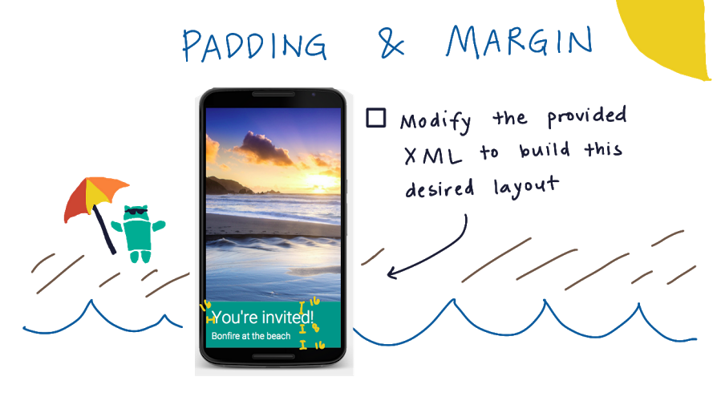

:title: Android Development for Beginners - practice set 1: Hello World
:author: Mario Bodemann
:css: lesson.css

----

:data-x: 0
:data-y: 0
:data-z: 0

.. container:: main-title

  Android Development for Beginners

.. container:: main-subtitle

  practice set 1: Hello World
  

.. container:: main-name

  Mario Bodemann @ GDG Android Berlin

.. image:: images/octobear.png
   :height: 700

----

:data-x: 30
:data-y: 100
:data-z: 50
:data-scale: .14
:data-rotate-x: -26

Thanks to 
=========

.. image:: images/thoughtworks-logo.png

for this space
--------------

and Udacity_ 
============

for the lessons
---------------

.. _Udacity: https://www.udacity.com/course/android-development-for-beginners--ud837

----

:class: new-section

:data-x: 279
:data-y: 0
:data-z: 25
:data-scale: .02
:data-rotate-x: 0

Where?
======

What?
=====

How?
====

----

:data-x: r30
:data-y: 0

Where?
======

* Drinks 

  * ←  
 
  * Please donate 1 € per drink in the brown cup

* Toilets 

  * ←  

* WiFi 

  * SSID: werkstatt → PWD: d1srupt1ve
  * (Shared, please be nice!)

----

What?
=====

* Learning to write Android Apps

  * No prior programming knowledge needed
  * Laptop with Internet, from next week Android Studio installed
  * 4 weeks with ca. 6h per week

* Android Development for Beginners @ Udacity
 
  * Link to https://www.udacity.com/course/android-development-for-beginners--ud837 
  * These slides http://j.mp/artab01

----

How?
====

* Everyweek: New chapter, new Video_
* Starting at 8 pm, lasting till roughly 11pm
  
  * Recap on last lesson
  * Ask questions, meet other learners
  * Time for free hacking on android ...
  * Not neccesary the best place to whatch the videos
  * After Recap: Open Round of questions

.. _Video: https://www.udacity.com/course/android-development-for-beginners--ud837

----

Your questions?
===============

----

:data-x: 0
:data-y: 0
:data-z: 0
:data-scale: 1

:class: transparent-slide

----

:class: new-section

:data-x: -500
:data-y: 90
:data-z: 25
:data-rotate-z: 11
:data-scale: .02

Repetiton
=========

----

:data-x: r-4
:data-y: r20

----

:class: new-section

:data-x: -450
:data-y: 90

Happy Birthday
==============

----

:data-x: r-4
:data-y: r20

----

.. image:: ./images/02-what-views.png

----

----

----

.. image:: ./images/03-solution.png

----

----

.. image:: ./images/androidparty.png

----

.. image:: ./images/04-dragndrop.png

----

.. image:: ./images/05-lyla-attributes.png

----

.. image:: ./images/05-solution.png

----

----

.. image:: ./images/07-textsize.jpg

----

----

----

----

.. image:: ./images/09-text-color.jpg

----

.. image:: ./images/09-solution.jpg

----

.. image:: ./images/10-scaletype.jpg

----

----

.. image:: ./images/11-which-scaletype.jpg

----

.. image:: ./images/12-margin.png

----

.. image:: ./images/12-solution.png

----

.. image:: ./images/13-cards.png

----

https://discussions.udacity.com/t/make-your-own-card/19643/22

----

Questions?
==========
