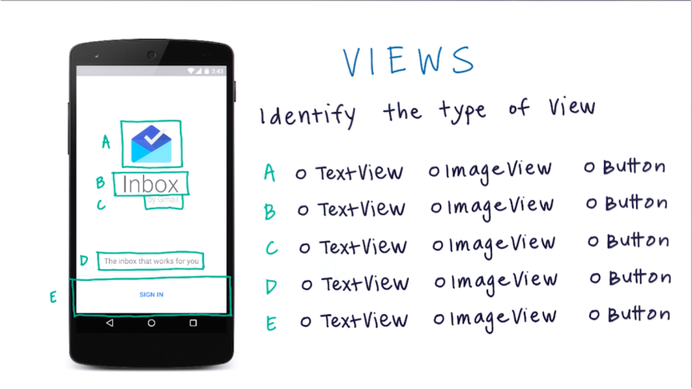
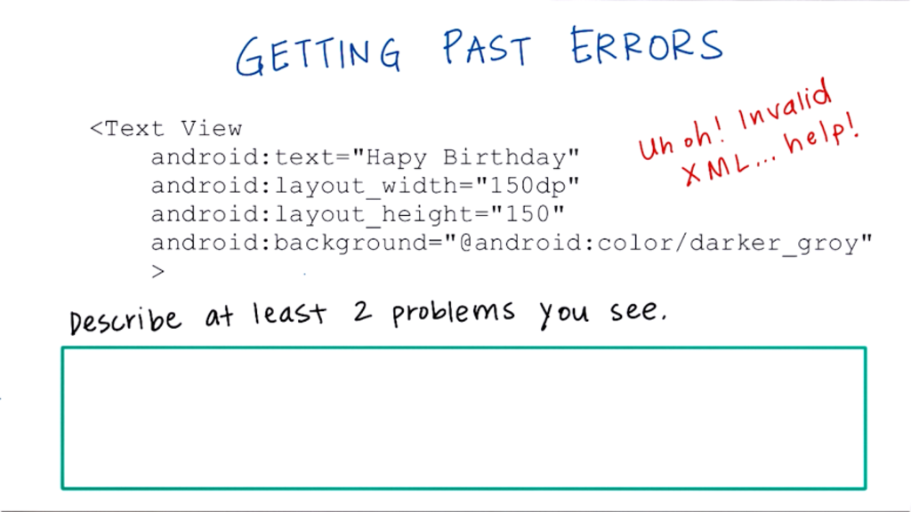
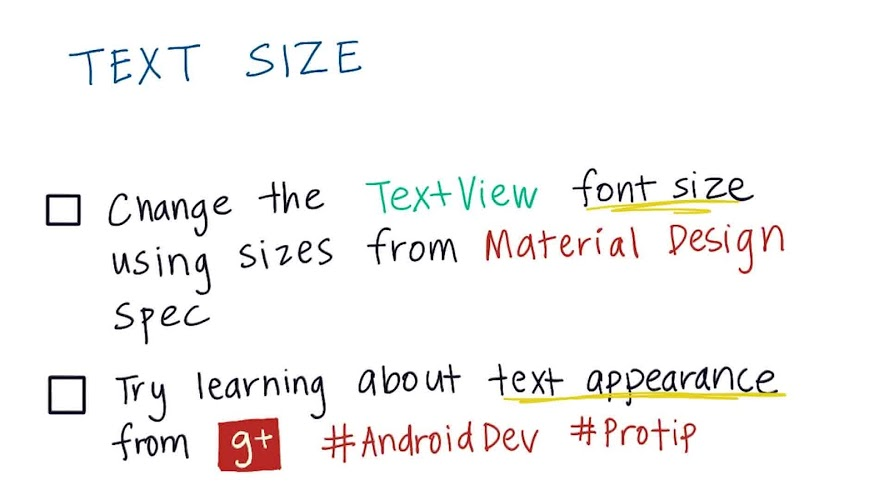

:title: Android Development for Beginners - lesson 1A: Building Layouts
:author: Mario Bodemann
:css: lesson.css

----

:data-x: 0
:data-y: 0
:data-z: 0

.. container:: main-title

  Android Development for Beginners

.. container:: main-subtitle

  Lesson 1A: Building Layouts
  

.. container:: main-name

  Mario Bodemann @ GDG Android Berlin

.. image:: images/octobear.png
   :height: 700

----

:data-x: 30
:data-y: 100
:data-z: 50
:data-scale: .14
:data-rotate-x: -26

Thanks to 
=========

.. image:: images/thoughtworks-logo.png

for this space
--------------

and Udacity_ 
============

for the lessons
---------------

.. _Udacity: https://www.udacity.com/course/android-development-for-beginners--ud837

----

:class: new-section

:data-x: 279
:data-y: 0
:data-z: 25
:data-scale: .02
:data-rotate-x: 0

Where?
======

What?
=====

How?
====

----

:data-x: r30
:data-y: 0

Where?
======

* Drinks 

  * ←  
 
  * Please donate 1 € per drink in the brown cup

* Toilets 

  * ←  

* WiFi 

  * SSID: werkstatt → PWD: d1srupt1ve
  * (Shared, please be nice!)

----

What?
=====

* Learning to write Android Apps

  * No prior programming knowledge needed
  * Laptop with Internet, from next week Android Studio installed
  * 4 weeks with ca. 6h per week

* Android Development for Beginners @ Udacity
 
  * Link to https://www.udacity.com/course/android-development-for-beginners--ud837 
  * These slides http://j.mp/artab01

----

How?
====

* Everyweek: New chapter, new Video_
* Starting at 8 pm, lasting till roughly 11pm
  
  * Recap on last lesson
  * Ask questions, meet other learners
  * Time for free hacking on android ...
  * Not neccesary the best place to whatch the videos
  * After Recap: Open Round of questions

.. _Video: https://www.udacity.com/course/android-development-for-beginners--ud837

----

Your questions?
===============

----

:data-x: 0
:data-y: 0
:data-z: 0
:data-scale: 1

:class: transparent-slide

----

:class: new-section

:data-x: 203
:data-y: -336
:data-z: 25
:data-scale: .02

Introduction
============

----

:data-x: r0
:data-y: r15

.. image:: ./images/01-tell-us-about-your-struggles.png

----

Sample Answers
==============

* Learning to play the piano
* Learning chineese
* …

What are yours?

----

:data-x: 233
:data-y: -336
:data-z: 25
:data-scale: .02

:class: new-section

Views
=====

----

:data-x: r0
:data-y: r15

----

----

.. image:: ./images/03-view-types.png

----

.. image:: ./images/03-solution-view-types.png

----

.. image:: ./images/04-observations.png

----

----

----

http://labs.udacity.com/android-visualizer/

.. image:: ./images/06-first-xml.png

----

.. image:: ./images/06-solution-first-xml.png

----

----

:class: code-slide

Correct xml

.. code:: xml
   
  <TextView
    android:text="Happy Birthday"
    android:layout_width="150dp"
    android:layout_height="150dp"
    android:background="@android:color/darker_gray"
  />

----

.. image:: ./images/08-wrap_content.jpg

----

:class: code-slide

.. code:: xml

  <TextView
    android:text="Lorem ipsum dolor sit amet, consectetur adipiscing elit, sed do eiusmod tempor incididunt ut labore et dolore magna aliqua. Ut enim ad minim veniam, quis nostrud exercitation ullamco laboris nisi ut aliquip ex ea commodo consequat. Duis aute irure dolor in reprehenderit in voluptate velit esse cillum dolore eu fugiat nulla pariatur. Excepteur sint occaecat cupidatat non proident, sunt in culpa qui officia deserunt mollit anim id est laborum."
    android:background="@android:color/darker_gray"
    android:layout_width="wrap_content"
    android:layout_height="wrap_content" />

----

----

.. image:: ./images/09-solution-font-size.png

----

.. image:: ./images/10-two-colors.png

----

:class: code-slide

.. code:: xml

  <TextView
    android:text="I got you a free hug. Surprise!"
    android:textColor="#FFFFFF"
    android:background="#000000"
    android:layout_width="wrap_content"
    android:layout_height="wrap_content"
    android:textSize="45sp" />

----

.. image:: ./images/11-images.jpg

----

----

----

:class: code-slide

.. code:: xml

  <TextView
    android:text="Oh the possibilities of TextView!"
    android:layout_width="wrap_content"
    android:layout_height="wrap_content"
    android:textSize="36sp" 
    android:textStyle="bold"
    />

----

:data-x: 1000
:data-z: 1500
:data-scale: 1

.. image:: ./images/fin.png

