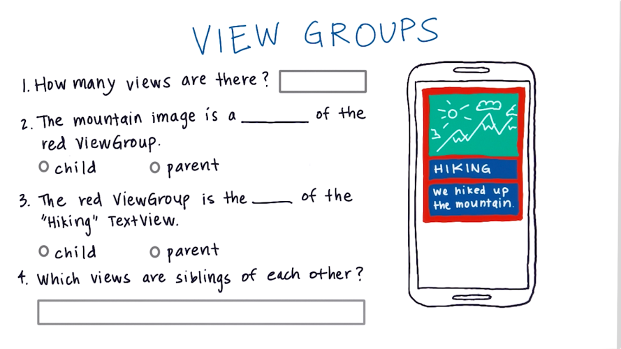
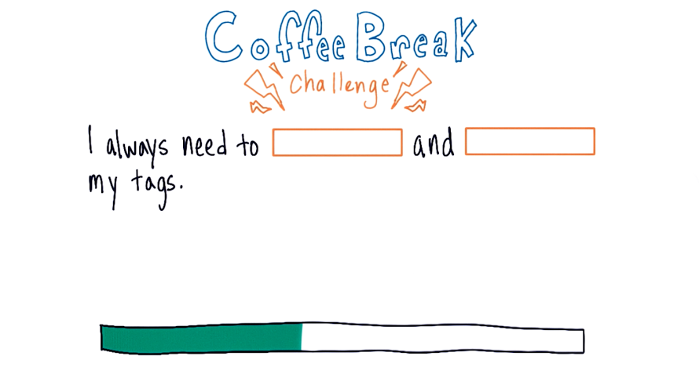

:title: Android Development for Beginners - lesson 1B: Building Layouts
:author: Mario Bodemann
:css: lesson.css

----

:data-x: 0
:data-y: 0
:data-z: 0

.. container:: main-title

  Android Development for Beginners

.. container:: main-subtitle

  Lesson 1B: Building Layouts
  

.. container:: main-name

  Mario Bodemann @ GDG Android Berlin

.. image:: images/octobear.png
   :height: 700

----

:data-x: 30
:data-y: 100
:data-z: 50
:data-scale: .14
:data-rotate-x: -26

Thanks to 
=========

.. image:: images/thoughtworks-logo.png

for this space
--------------

and Udacity_ 
============

for the lessons
---------------

.. _Udacity: https://www.udacity.com/course/android-development-for-beginners--ud837

----

:class: new-section

:data-x: 279
:data-y: 0
:data-z: 25
:data-scale: .02
:data-rotate-x: 0

Where?
======

What?
=====

How?
====

----

:data-x: r30
:data-y: 0

Where?
======

* Drinks 

  * ←  
 
  * Please donate 1 € per drink in the brown cup

* Toilets 

  * ←  

* WiFi 

  * SSID: werkstatt → PWD: d1srupt1ve
  * (Shared, please be nice!)

----

What?
=====

* Learning to write Android Apps

  * No prior programming knowledge needed
  * Laptop with Internet, from next week Android Studio installed
  * 4 weeks with ca. 6h per week

* Android Development for Beginners @ Udacity
 
  * Link to https://www.udacity.com/course/android-development-for-beginners--ud837 
  * These slides http://j.mp/artab01

----

How?
====

* Everyweek: New chapter, new Video_
* Starting at 8 pm, lasting till roughly 11pm
  
  * Recap on last lesson
  * Ask questions, meet other learners
  * Time for free hacking on android ...
  * Not neccesary the best place to whatch the videos
  * After Recap: Open Round of questions

.. _Video: https://www.udacity.com/course/android-development-for-beginners--ud837

----

Your questions?
===============

----

:data-x: 0
:data-y: 0
:data-z: 0
:data-scale: 1

:class: transparent-slide

----

:class: new-section

:data-x: -319
:data-y: -57
:data-z: 25
:data-scale: .02

Repetiton
=========

----

:data-x: r10
:data-y: r20

.. image:: ./images/repetetition.png

----

:class: new-section

ViewGroups
==========

----

----

.. image:: ./images/01-solution-view-groups.png

----

----

:class: code-slide

https://gist.github.com/anonymous/cd7fda2fa5c4062acb92

.. code:: xml

  <LinearLayout
    android:orientation="vertical"
    android:layout_width="wrap_content"
    android:layout_height="wrap_content">
 
    <TextView
        android:text="Guest List"
        android:layout_width="wrap_content"
        android:layout_height="wrap_content" />
 
    <TextView
        android:text="Kunal"
        android:layout_width="wrap_content"
        android:layout_height="wrap_content" />
 
  </LinearLayout>

----

.. image:: ./images/03-experiments.png

http://labs.udacity.com/android-visualizer/#/android/linear-layout

----

.. image:: ./images/04-match_parent.png

http://labs.udacity.com/android-visualizer/#/android/match-parent

----

----

.. image:: ./images/06-ocean-view.png

http://labs.udacity.com/android-visualizer/#/android/linear-layout-weight

----

:class: code-slide-tiny

https://gist.github.com/anonymous/cd7fda2fa5c4062acb92

.. code:: xml

  <LinearLayout
    xmlns:android="http://schemas.android.com/apk/res/android"
    android:orientation="vertical"
    android:layout_width="match_parent"
    android:layout_height="match_parent">

    <ImageView
        android:src="@drawable/ocean"
        android:layout_width="wrap_content"
        android:layout_height="0dp"
        android:layout_weight="1"
        android:scaleType="centerCrop" />

    <TextView
        android:text="You're invited!"
        android:layout_width="match_parent"
        android:layout_height="wrap_content"
        android:textColor="@android:color/white"
        android:textSize="54sp"
        android:layout_weight="0"
        android:background="#009688" />

    <TextView
        android:text="Bonfire at the beach"
        android:layout_width="match_parent"
        android:layout_height="wrap_content"
        android:textColor="@android:color/white"
        android:textSize="34sp"
        android:layout_weight="0"
        android:background="#009688" />

  </LinearLayout>

----

----

:class: code-slide-tiny

https://gist.github.com/anonymous/e7eb5ceff9dedfc376eb

.. code:: xml

  <RelativeLayout
       xmlns:android="http://schemas.android.com/apk/res/android"
       android:layout_width="match_parent"
       android:layout_height="match_parent"
       android:padding="16dp">
 
   <TextView
        android:text="I’m in this corner"
        android:layout_height="wrap_content"
        android:layout_width="wrap_content"
        android:layout_alignParentBottom="true"
        android:layout_alignParentLeft="true" />
 
    <TextView
        android:text="No, up here"
        android:layout_height="wrap_content"
        android:layout_width="wrap_content"
        android:layout_alignParentTop="true"
        android:layout_alignParentLeft="true" />
 
    <TextView
        android:text="Wait, I’m here"
        android:layout_height="wrap_content"
        android:layout_width="wrap_content"
        android:layout_alignParentBottom="true"
        android:layout_alignParentRight="true" />
 
    <TextView
        android:text="Actually, I’m here"
        android:layout_height="wrap_content"
        android:layout_width="wrap_content"
        android:layout_alignParentTop="true"
        android:layout_alignParentRight="true" />
 
  </RelativeLayout>

----

:data-x: r-10
:data-y: r20

----

:data-x: r-30
:data-y: r13

http://labs.udacity.com/android-visualizer/#/android/relative-layout-view-ids

.. image:: ./images/08-seating.png

----

:class: code-slide-tiny

.. code:: xml

  <RelativeLayout
    xmlns:android="http://schemas.android.com/apk/res/android"
    android:layout_width="match_parent"
    android:layout_height="match_parent">

    <TextView
        android:id="@+id/lyla_text_view"
        android:layout_width="wrap_content"
        android:layout_height="wrap_content"
        android:layout_alignParentBottom="true"
        android:layout_alignParentLeft="true"
        android:textSize="24sp"
        android:text="Lyla" />

    <TextView
        android:id="@+id/me_text_view"
        android:layout_width="wrap_content"
        android:layout_height="wrap_content"
        android:layout_alignParentBottom="true"
        android:layout_toRightOf="@id/lyla_text_view"
        android:textSize="24sp"
        android:text="Me" />

    <TextView
        android:id="@+id/natalie_text_view"
        android:layout_width="wrap_content"
        android:layout_height="wrap_content"
        android:layout_above="@id/lyla_text_view"
        android:textSize="24sp"
        android:text="Natalie" />

    <TextView
        android:id="@+id/jennie_text_view"
        android:layout_width="wrap_content"
        android:layout_height="wrap_content"
        android:layout_alignParentBottom="true"
        android:layout_alignParentRight="true"
        android:textSize="24sp"
        android:text="Jennie" />

    <TextView
        android:id="@+id/omoju_text_view"
        android:layout_width="wrap_content"
        android:layout_height="wrap_content"
        android:layout_alignParentRight="true"
        android:layout_above="@id/jennie_text_view"
        android:textSize="24sp"
        android:text="Omoju" />

    <TextView
        android:id="@+id/amy_text_view"
        android:layout_width="wrap_content"
        android:layout_height="wrap_content"
        android:layout_alignParentRight="true"
        android:layout_above="@id/omoju_text_view"
        android:textSize="24sp"
        android:text="Amy" />

    <TextView
        android:id="@+id/ben_text_view"
        android:layout_width="wrap_content"
        android:layout_height="wrap_content"
        android:layout_alignParentTop="true"
        android:layout_centerHorizontal="true"
        android:textSize="24sp"
        android:text="Ben" />

    <TextView
        android:id="@+id/kunal_text_view"
        android:layout_width="wrap_content"
        android:layout_height="wrap_content"
        android:layout_alignParentTop="true"
        android:layout_toLeftOf="@id/ben_text_view"
        android:textSize="24sp"
        android:text="Kunal" />

    <TextView
        android:id="@+id/kagure_text_view"
        android:layout_width="wrap_content"
        android:layout_height="wrap_content"
        android:layout_alignParentTop="true"
        android:layout_toRightOf="@id/ben_text_view"
        android:textSize="24sp"
        android:text="Kagure" />

  </RelativeLayout>

----

:data-x: r-30

http://labs.udacity.com/android-visualizer/#/android/relative-layout-list-item

.. image:: ./images/09-item-view.png

----

:data-x: r-30
:data-y: r-10

:class: code-slide-tiny

.. code:: xml

 <RelativeLayout
    xmlns:android="http://schemas.android.com/apk/res/android"
    android:layout_width="match_parent"
    android:layout_height="wrap_content"
    >

    <ImageView
        android:id="@+id/image"
        android:layout_width="56dp"
        android:layout_height="56dp"
        android:scaleType="centerCrop"
        android:src="@drawable/ocean" />

    <TextView
        android:id="@+id/name"
        android:layout_width="wrap_content"
        android:layout_height="wrap_content"
        android:text="Pebble Beach"
        android:layout_toRightOf="@id/image"
        android:textAppearance="?android:textAppearanceMedium" />

    <TextView
        android:layout_width="wrap_content"
        android:id="@+id/place"
        android:layout_height="wrap_content"
        android:text="California"
        android:layout_toRightOf="@id/image"
        android:layout_below="@id/name"
        android:textAppearance="?android:textAppearanceSmall" />

    <TextView
        android:layout_width="wrap_content"
        android:layout_height="wrap_content"
        android:layout_toRightOf="@id/image"
        android:layout_below="@id/place"
        android:text="10 miles away"
        android:textAppearance="?android:textAppearanceSmall" />

  </RelativeLayout>

----

http://labs.udacity.com/android-visualizer/#/android/padding-and-margin

.. image:: ./images/10-padding-margin.png

----

:class: code-slide-tiny

.. code:: xml
 
 <LinearLayout
    xmlns:android="http://schemas.android.com/apk/res/android"
    android:layout_width="match_parent"
    android:layout_height="match_parent"
    android:orientation="vertical">

    <ImageView
        android:src="@drawable/ocean"
        android:layout_width="match_parent"
        android:layout_height="0dp"
        android:layout_weight="1"
        android:scaleType="centerCrop" />

    <TextView
        android:text="You're invited!"
        android:layout_width="match_parent"
        android:layout_height="wrap_content"
        android:textColor="@android:color/white"
        android:textSize="45sp"
        android:paddingTop="16dp"
        android:paddingLeft="16dp"
        android:paddingBottom="8dp"
        android:paddingRight="16dp"
        android:background="#009688"/>

    <TextView
        android:text="Bonfire at the beach"
        android:layout_width="match_parent"
        android:layout_height="wrap_content"
        android:textColor="@android:color/white"
        android:textSize="24sp"
        android:paddingLeft="16dp"
        android:paddingBottom="16dp"
        android:paddingRight="16dp"
        android:background="#009688"/>

 </LinearLayout>

----

:data-x: r0
:data-y: r-20

.. image:: ./images/fin.png

... but wait ...

----

Have you installed the JDK?
===========================

Please follow https://www.udacity.com/course/viewer#!/c-ud837/l-4034888704/m-4182118788 
to do so …

----

What about Android Studio?
==========================

https://www.udacity.com/course/viewer#!/c-ud837/l-4034888704/m-4300158589

----

:data-x: r0
:data-y: r0
:data-z: 25
:data-rotate-x: -90

Coffee Break anyone?
====================

----

:data-z: 100

.. image:: ./images/coffee-01.png

----

:data-z: 125

.. image:: ./images/coffee-01.png

Answer: ImageView
=================

----

:data-z: 150
:class: transparent-slide

.. image:: ./images/coffee-02.png

----

:data-x: r40
:data-z: 175

.. image:: ./images/coffee-02.png

Answer: Attributes
==================

----

:data-x: r-40
:data-z: 200

.. image:: ./images/coffee-03.png

----

:data-x: r0
:data-z: 225

.. image:: ./images/coffee-04.png

----

:data-z: 250

----

:data-z: 275

.. image:: ./images/coffee-06.png

----

:data-x: r40
:data-z: 275

.. image:: ./images/coffee-06.png

Katherine and Kunal

----

:data-x: r-40
:data-z: 300

.. image:: ./images/coffee-07.png

----

:data-x: r40
:data-z: 300

.. image:: ./images/coffee-07.png

layout_weight="1" on line 21

----

:data-x: r-40
:data-z: 325

.. image:: ./images/coffee-08.png

----

:data-x: r0
:data-z: 350

----

:data-x: r40
:data-z: 350

android:layout_alignParentBottom="true"

android:layout_centerHorizontal="true"

----

:data-x: r-40
:data-z: 375

----

:data-x: r0
:data-z: 400

100dp

----

:data-x: r0
:data-z: 500

.. image:: ./images/coffee-fin.png

----

:data-x: r0
:data-z: 500
:data-rotate-x: 0

.. image:: ./images/coffee-fin.png

Kagure
