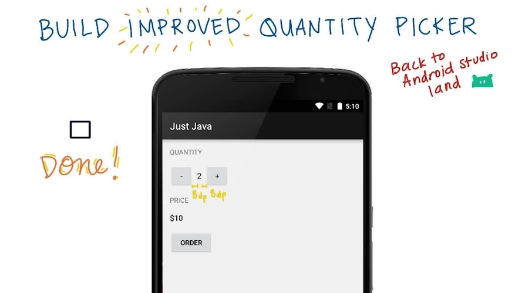

:title: Android Development for Beginners - lesson 2b: interaction
:author: Mario Bodemann
:css: lesson.css

----

:data-x: 0
:data-y: 0
:data-z: 0

.. container:: main-title

  Android Development for Beginners

.. container:: main-subtitle

  lesson 2b: Making an app interactive
  

.. container:: main-name

  Mario Bodemann @ GDG Android Berlin

.. image:: images/androidparty.png
   :height: 728
   :width: 664

----

:data-x: 30
:data-y: 100
:data-z: 50
:data-scale: .14
:data-rotate-x: -26

Thanks to 
=========

.. image:: images/thoughtworks-logo.png

for this space
--------------

and Udacity_ 
============

for the lessons
---------------

.. _Udacity: https://www.udacity.com/course/android-development-for-beginners--ud837

----

:class: new-section

:data-x: 500
:data-y: 90
:data-z: 25
:data-rotate-z: 11
:data-scale: .02

Repetiton
=========

----

:data-x: r-4
:data-y: r20

.. image:: ./images/recap.jpg

----

:class: new-section

Ordering Coffee
===============

----

----

https://gist.github.com/anonymous/256752a04db14a3947a8

----

a)
==

----

b)
==

.. image:: ./images/02-b.png

----

c)
==

.. image:: ./images/02-c.png

----

.. image:: ./images/02-all.png

----

----

----

----

https://gist.github.com/anonymous/f5feae51009b9f8bc956

----

.. image:: ./images/05-solution.jpg

----

.. image:: ./images/06.jpg

----

----

----

newline!

----

Questions?
==========

