:title: Android Study Jam, Lesson 4b
:author: Mario Bodemann
:description: Content Provider, Content Resolver 
:keywords: android, content, provider, resolver
:css: lesson4b.css

----

:id: start
:data-rotate-y: -60

.. container:: main-title

  Android Study Jam: Lesson 4b

.. container:: main-subtitle

  Content Provider and Content Resolver

.. image:: images/android_robot_200.png
   :height: 700

----

:data-y: r1000
:data-rotate-y: 0

Thanks to 
=========

.. image:: images/thoughtworks-logo.png

for this space
==============

----

<-- Drinks/Toilet
=================

----

WiFi password -->
=================

----

Hi, my name is *Mario*, and who are *you*?
==========================================

----

:data-rotate-y: 0
:data-x: 1200
:data-y: 0
:data-z: 0
:class: new-section

Lesson 4a
=========

Data
----

----

:data-x: r1200
:data-y: 0

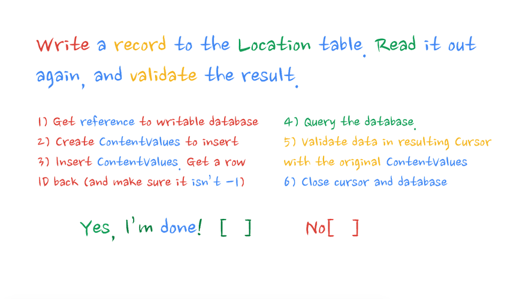

----

:data-x: r1200
:data-y: 0

----

./run-as ...
============

Does only work from 4.4.x or pre 4.3.2 due to a bug in android.

#. Upgrade Andoid  might help (?)
#. use in app share/file saving
#. root phone and replace permissions

see issue 58373_ on android.

.. _58373: https://code.google.com/p/android/issues/detail?id=58373

----

:data-x: 1200
:data-y: 1000
:class: new-section

Lesson 4b
=========

Content Provider
----------------

----

:data-x: r1200
:data-y: 1000

4 Steps in building a content provider
======================================

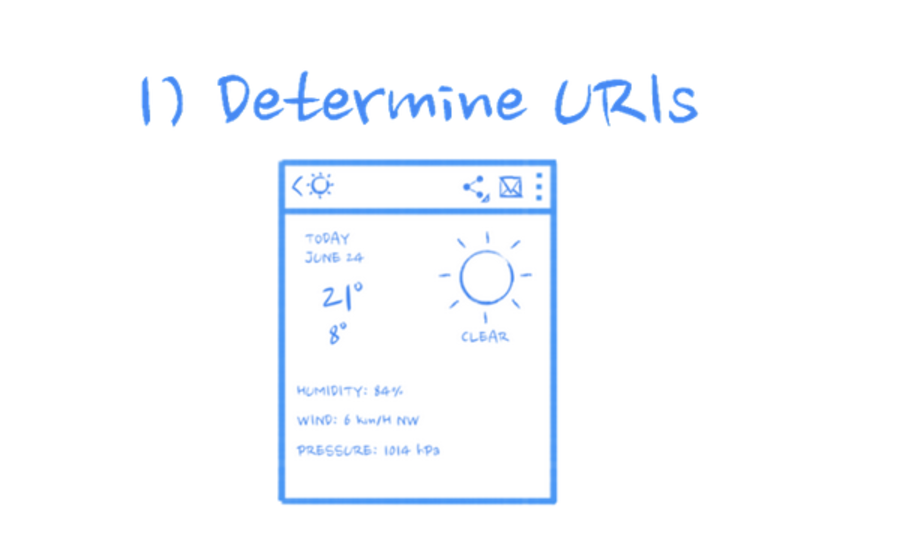

----

:data-x: r1200
:data-y: 1000

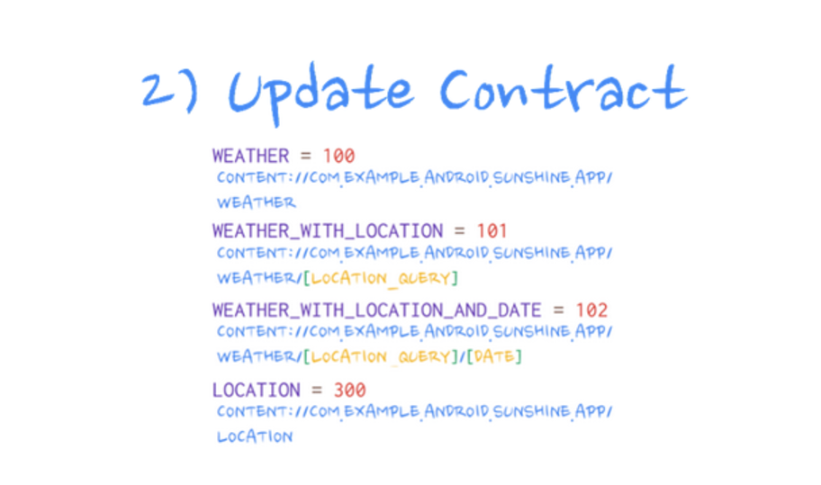

----

:data-x: r1200
:data-y: 1000

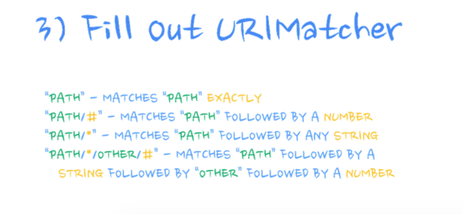

----

:data-x: r1200
:data-y: 1000

.. image:: images/content-provider-step-3.png

----

:data-x: r1200
:data-y: 1000

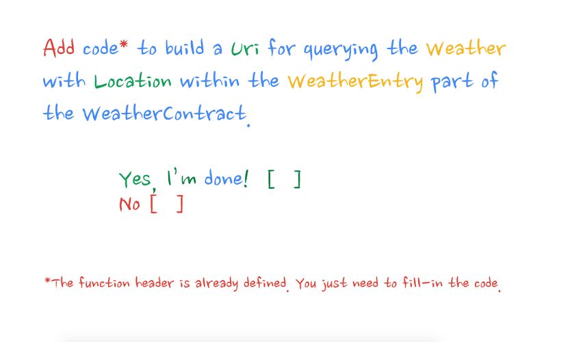

----

:data-x: r0
:data-y: 1400
:data-z: 600
:data-rotate-x: 90

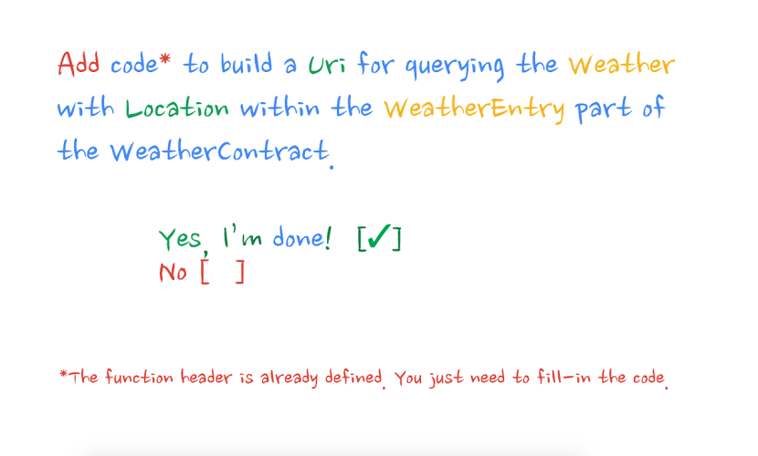

----

:class: code-slide
:data-x: r0
:data-y: r0
:data-z: 1600

.. code:: java
  
  public static Uri buildWeatherLocation(
        String locationSetting) {
    return CONTENT_URI.buildUpon()
        .appendPath(locationSetting)
        .build();
    // content://com.example.android.sunshine.app/
    // ↳ weather/%2FNorth%20Pole
  }

----

:data-x: r1200
:data-y: 1000
:data-z: 0
:data-rotate-x: 0

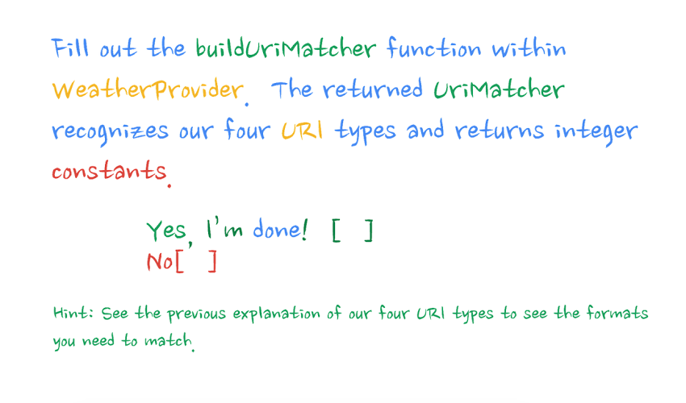

----

:data-x: r0
:data-y: 1400
:data-z: 600
:data-rotate-x: 90

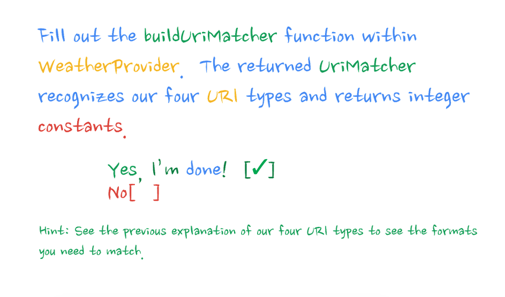

----

:class: code-slide
:data-x: r0
:data-y: r0
:data-z: 1600

.. code:: java
  
    static UriMatcher buildUriMatcher() {
        UriMatcher result = new UriMatcher(
                UriMatcher.NO_MATCH);

        result.addURI(WeatherContract.CONTENT_AUTHORITY, 
                WeatherContract.PATH_WEATHER, 
                WEATHER);
        result.addURI(WeatherContract.CONTENT_AUTHORITY, 
                WeatherContract.PATH_WEATHER + "/*", 
                WEATHER_WITH_LOCATION);
        result.addURI(WeatherContract.CONTENT_AUTHORITY, 
                WeatherContract.PATH_WEATHER + "/*/#", 
                WEATHER_WITH_LOCATION_AND_DATE);
        result.addURI(WeatherContract.CONTENT_AUTHORITY, 
                WeatherContract.PATH_LOCATION, 
                LOCATION);
        return result;
    }

----

:data-x: r1200
:data-y: 1000
:data-z: 0
:data-rotate-x: 0

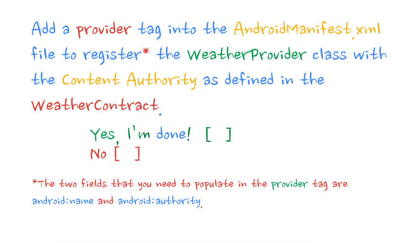

----

:data-x: r0
:data-y: 1400
:data-z: 600
:data-rotate-x: 90

----

:data-x: r0
:data-y: r0
:data-z: 1600

.. code:: xml
  :class: code-slide
    
   <provider
     android:name=
       ".data.WeatherProvider"
     android:authorities=
       "com.example.android.sunshine.app" 
   />

if *authority* requested

use *name* as classname as provider.

----

:data-x: r1200
:data-y: 1000
:data-z: 0
:data-rotate-x: 0

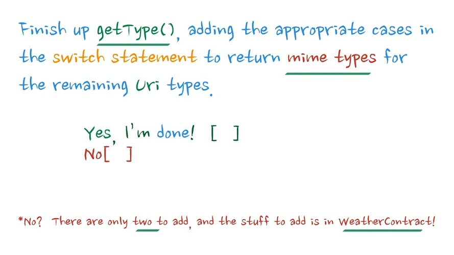

----

:data-x: r0
:data-y: 1400
:data-z: 600
:data-rotate-x: 90

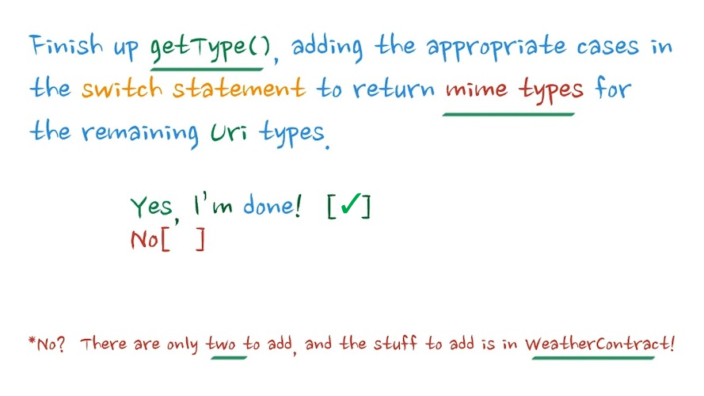

----

:data-x: r0
:data-y: r0
:data-z: 1600
:class: code-slide

.. code:: java

   
    public String getType(Uri uri) {
        final int match = sUriMatcher.match(uri);
        switch (match) {
            case WEATHER_WITH_LOCATION_AND_DATE:
                return WeatherEntry.CONTENT_ITEM_TYPE;
            case WEATHER_WITH_LOCATION:
                return LocationEntry.CONTENT_TYPE;
            //...
        }
    }

----

:data-x: r1200
:data-y: 1000
:data-z: 0
:data-rotate-x: 0

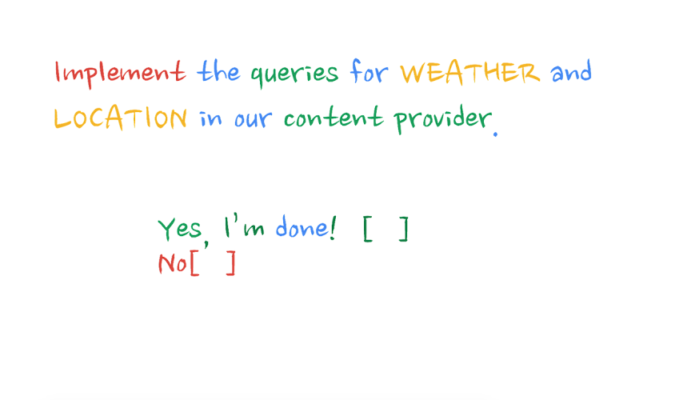

----

:data-x: r0
:data-y: 1400
:data-z: 600
:data-rotate-x: 90

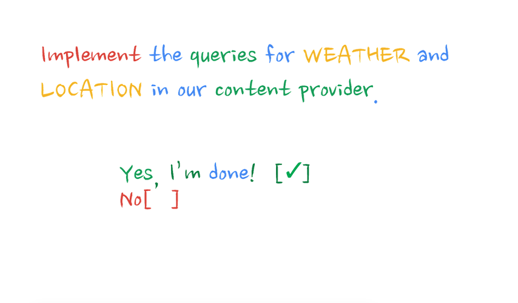

----

:data-x: r0
:data-y: r0
:data-z: 1600
:class: code-slide

.. code:: java

            case WEATHER: 
                retCursor = mOpenHelper.getReadableDatabase().
                    query(
                        WeatherEntry.TABLE_NAME, // table
                        projection, // all selected columns
                        selection, // selection
                        selectionArgs, // argument
                        null, // group by
                        null, // having
                        sortOrder// orderby
                );
                break;break;

----

:data-x: r0
:data-y: r0
:data-z: 2600
:class: code-slide

.. code:: java

            case LOCATION: 
                retCursor = mOpenHelper.getReadableDatabase().
                    query(
                        LocationEntry.TABLE_NAME, // table
                        projection, // all columns
                        selection, // selection
                        selectionArgs, // argument
                        null, // group by
                        null, // having
                        sortOrder // orderby
                );
                break;

----

:data-x: r1200
:data-y: 1000
:data-z: 0
:data-rotate-x: 0

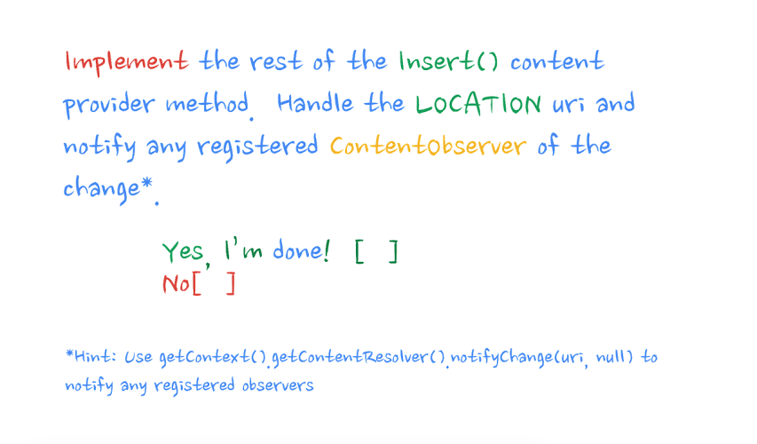

----

:data-x: r0
:data-y: 1400
:data-z: 600
:data-rotate-x: 90

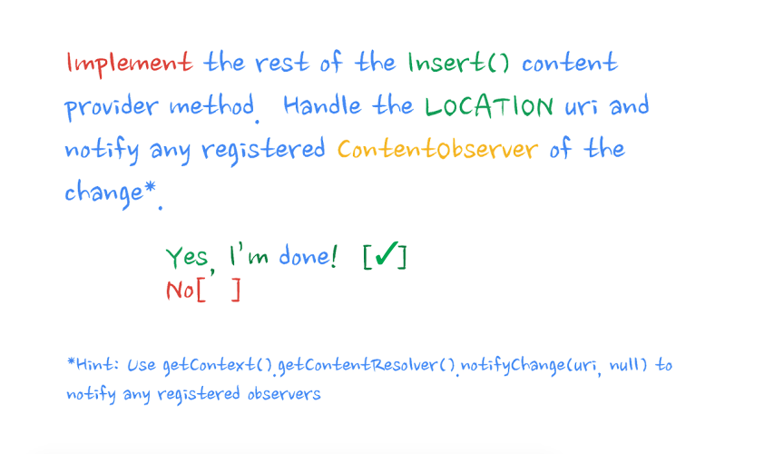

----

:data-x: r0
:data-y: r0
:data-z: 1600
:class: code-slide

.. code:: java

    case LOCATION: {
        long id = db.insert(LocationEntry.TABLE_NAME, 
            null, values);
        if (id > 0) {
            returnUri = LocationEntry.buildLocationUri(id);
        } else {
            throw new SQLException(
               "Failing insert into row " + uri);
        }
        break;
    }

----

:data-x: r1200
:data-y: 1000
:data-z: 0
:data-rotate-x: 0

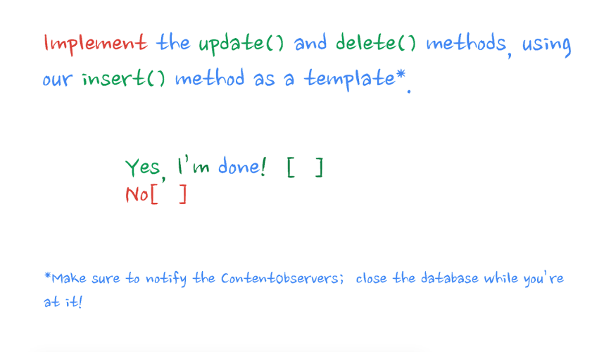

----

:data-x: r0
:data-y: 1400
:data-z: 600
:data-rotate-x: 90

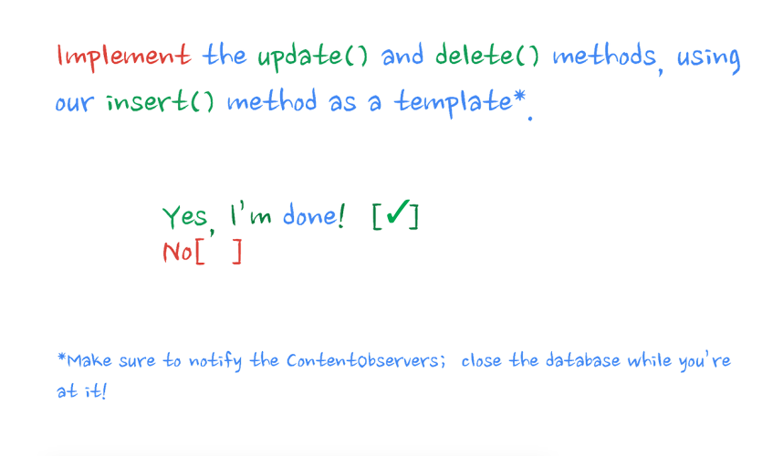

----

:data-x: r0
:data-y: r0
:data-z: 1600
:class: code-slide

.. code:: java

    public int delete(Uri uri, String selection, 
                String[] selectionArgs) {
        final SQLiteDatabase db = 
                mOpenHelper.getWritableDatabase();
        final int match = sUriMatcher.match(uri);
        int deletedRows = 0;

        if (TextUtils.isEmpty(selection)) {
            selection = "1";
        }

----

:data-x: r0
:data-y: r0
:data-z: 2600
:class: code-slide

.. code:: java

        switch (match) {
            case WEATHER:
                deletedRows = db.delete(
                        WeatherEntry.TABLE_NAME, 
                        selection, 
                        selectionArgs);
                break;

            case LOCATION:
                deletedRows = db.delete(
                        LocationEntry.TABLE_NAME, 
                        selection, 
                        selectionArgs);
                break;
            default:
                throw new UnsupportedOperationException();
        }
        

----

:data-x: r0
:data-y: r0
:data-z: 3600
:class: code-slide

.. code:: java

        if (deletedRows > 0) {
            getContext().getContentResolver()
                .notifyChange(uri, null);
        }

        return deletedRows;
    }

----

:data-x: r0
:data-y: r0
:data-z: 4600
:class: code-slide

Difference between delete and update

.. code:: java

        switch (match) {
            case WEATHER:
                updatedRows = db.update(
                        WeatherEntry.TABLE_NAME, 
                        values, // < update
                        selection, 
                        selectionArgs);
                break;
            case LOCATION:
                updatedRows = db.update(
                        LocationEntry.TABLE_NAME, 
                        values, // < update
                        selection, 
                        selectionArgs);
                break;
            default:
                throw new UnsupportedOperationException();
        }

----

:data-x: r1200
:data-y: 1000
:data-z: 0
:data-rotate-x: 0

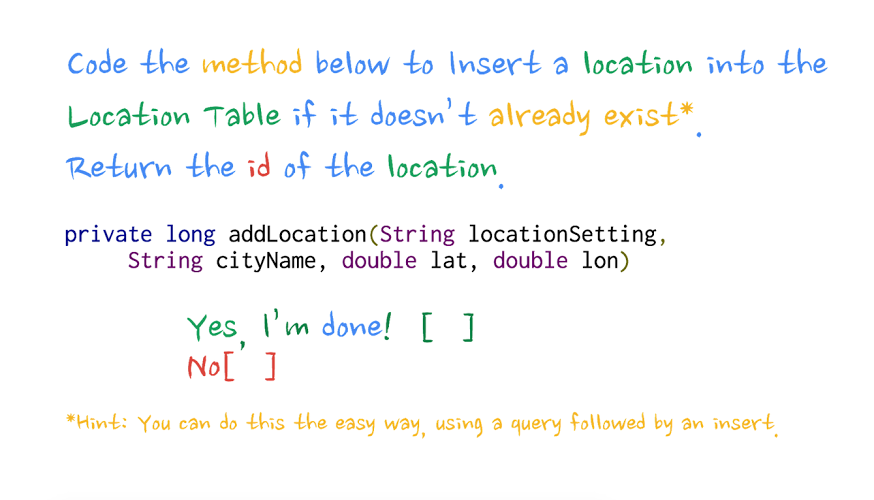

----

:data-x: r0
:data-y: 1400
:data-z: 600
:data-rotate-x: 90

----

:data-x: r0
:data-y: r0
:data-z: 1600
:class: code-slide

.. code:: java

  Cursor locationCursor = mContext
    .getContentResolver()
      .query(
        LocationEntry.CONTENT_URI,
        new String[]{LocationEntry._ID},
        LocationEntry.COLUMN_LOCATION_SETTING + " = ?",
        new String[]{locationSetting},
        null);

----

:data-x: r0
:data-y: r0
:data-z: 2600
:class: code-slide

.. code:: java

  if (locationCursor.moveToFirst()) {
    int locationIdIndex = locationCursor
      .getColumnIndex(LocationEntry._ID);
    locationId = locationCursor.getLong(locationIdIndex);
  } else {

----

:data-x: r0
:data-y: r0
:data-z: 3600
:class: code-slide

.. code:: java

    ContentValues locationValues = new ContentValues();

    locationValues.put(LocationEntry.COLUMN_CITY_NAME, 
      cityName);
    locationValues.put(LocationEntry.
      COLUMN_LOCATION_SETTING, 
      locationSetting);
    /// .,.

    Uri insertedUri = mContext.getContentResolver().
      insert(
        WeatherContract.LocationEntry.CONTENT_URI,
        locationValues);

    locationId = ContentUris.parseId(insertedUri);
  }
  return locationId;

----

:data-x: r1200
:data-y: 1000
:data-z: 0
:data-rotate-x: 0

----

:data-x: r0
:data-y: 1400
:data-z: 600
:data-rotate-x: 90

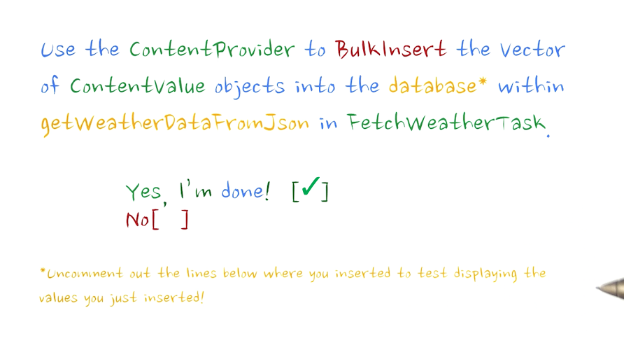

----

:data-x: r0
:data-y: r0
:data-z: 1600
:class: code-slide

.. code:: java

  if ( cVVector.size() > 0 ) {
    ContentValues[] cvArray = 
      new ContentValues[cVVector.size()];
    cVVector.toArray(cvArray);
    mContext.getContentResolver().
      bulkInsert(
        WeatherEntry.CONTENT_URI, 
        cvArray);
  }

----

:data-x: r1200
:data-y: 1000
:data-z: 1500
:data-rotate-y: 75
:data-rotate-x: 0

Done.
=====

Questions???
------------

