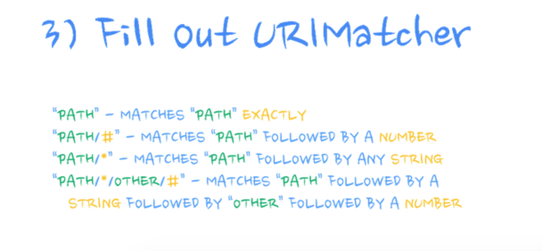
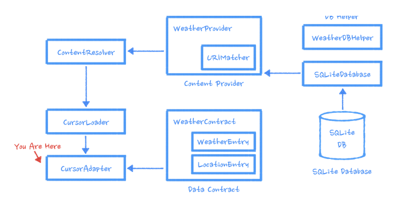
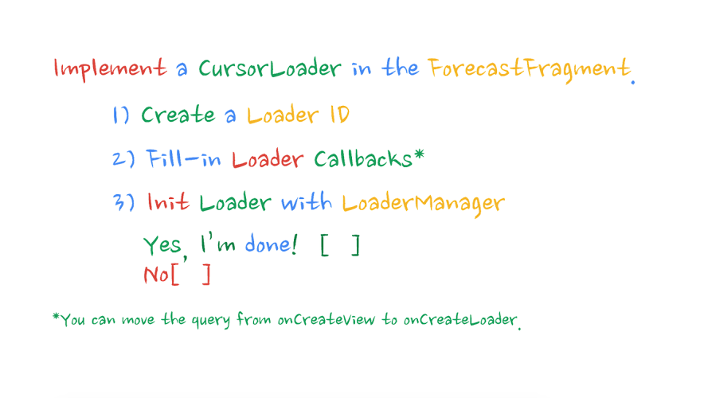
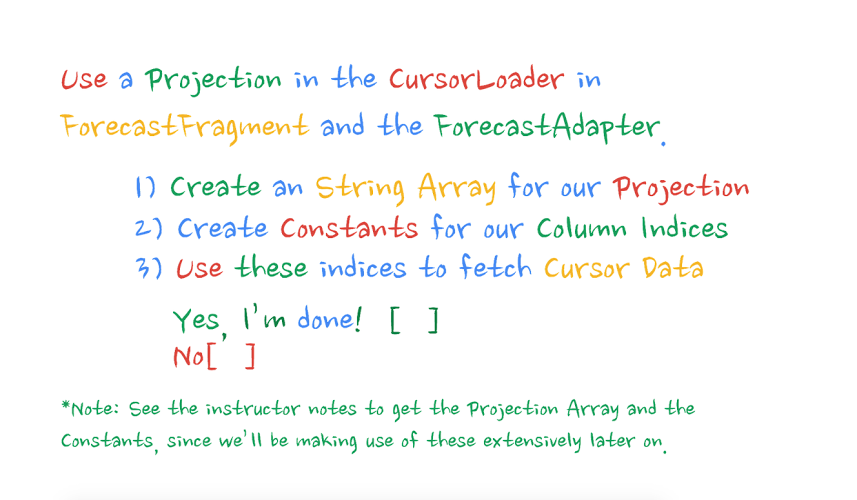
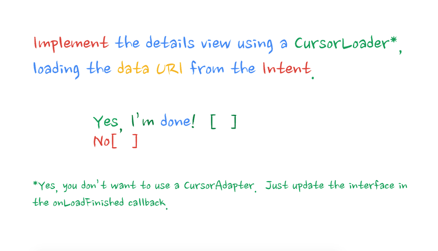

:title: Android Study Jam, Lesson 4c
:author: Mario Bodemann
:description: Content Provider, Content Resolver, Loaders
:keywords: android, content, provider, resolver, loaders
:css: lesson4c.css

----

:data-rotate-y: -60

.. container:: main-title

  Android Study Jam: Lesson 4c

.. container:: main-subtitle

  Content Loader

.. image:: images/android_robot_200.png
   :height: 700

.. note::
   do we speak english or german?

----

:data-x: r2000
:data-rotate-y: 0

Thanks to 
=========

.. image:: images/thoughtworks-logo.png

for this space
==============

----

<-- Drinks/Toilet
=================

.. note::
   Please donate something per drink.

----

WiFi password -->
=================

----

Hi, my name is *Mario*, and who are *you*?
==========================================

.. note::
   Please keep it short, and if we are already familiar, ignore.

----

:class: new-section

Lesson 4b
=========

Content Provider
----------------

----

:data-x: r0
:data-y: r2000

4 Steps in building a content provider
======================================

.. image:: images/content-provider-step-0.png 

----

.. image:: images/content-provider-step-1.png

----

----

.. image:: images/content-provider-step-3.png

----

:class: new-section

Lesson 4c
=========

Loader
------

----

:data-x: r-2000
:data-y: r0

.. note::
   ask audience

----

.. note:: 
   similar to first lessons: binding ui to background is bad

----

.. note::
   read data from provider

   change **ForecastAdapter** from **ArrayAdapter** to **CursorAdapter**

   move ui related code to Utility, and out of the *task*

   **Problem**: *Query* will be executed on UI thread, see above

----

.. note:: 
   Leaving out checkmark slides

----

:class: code-slide

.. note::

   Fragment!

   LOADER_ID can be "anything" but unique per LoaderManager.

.. code:: java
    
    public class ForecastFragment 
        extends Fragment 
        implements LoaderManager.LoaderCallbacks<Cursor> {

    private static final int LOADER_WEATHER_ID = 0;

    // [...]

    @Override
    public void onActivityCreated(@Nullable Bundle 
        savedInstanceState) {
     
        super.onActivityCreated(savedInstanceState);
        getActivity().getLoaderManager().initLoader(
            LOADER_WEATHER_ID, null, this);
    }

----

:class: code-slide

.. code:: java

    @Override
    public Loader<Cursor> onCreateLoader(int id, 
        Bundle args) {

        final String locationSetting = 
            Utility.getPreferredLocation(getActivity());
        final String sortOrder = 
            WeatherEntry.COLUMN_DATE + " ASC";
        final Uri weatherForLocationUri = 
            WeatherEntry.buildWeatherLocationWithStartDate(
                locationSetting, 
                System.currentTimeMillis());

        return new CursorLoader(getActivity(), // context 
            weatherForLocationUri, // uri
            null, // projection
            null, // selection
            null, // selection arguments 
            sortOrder); // sortorder
    }

----

:class: code-slide

.. code:: java

    @Override
    public void onLoadFinished(Loader<Cursor> loader, 
        Cursor cursor) {
        mForecastAdapter.swapCursor(cursor);
    }

    @Override
    public void onLoaderReset(Loader<Cursor> loader) {
        mForecastAdapter.swapCursor(null);
    }

----

.. note::
   Ignoring check mark question, again

----

:class: code-slide

.. note::
   This and next code comes from WeatherContract
   
   I just put it into **WeatherContract**. It might also live in ForecastFragment, but I wanted to keep it central ...

.. code:: java

    private static final String[] FORECAST_COLUMNS = {
        WeatherEntry.TABLE_NAME + "." + WeatherEntry._ID,
        WeatherEntry.COLUMN_DATE,
        WeatherEntry.COLUMN_SHORT_DESC,
        WeatherEntry.COLUMN_MAX_TEMP,
        WeatherEntry.COLUMN_MIN_TEMP,
        LocationEntry.COLUMN_LOCATION_SETTING,
        WeatherEntry.COLUMN_WEATHER_ID,
        LocationEntry.COLUMN_COORD_LAT,
        LocationEntry.COLUMN_COORD_LONG
    };

----

:class: code-slide

.. code:: java

    static final int COL_WEATHER_ID = 0;
    static final int COL_WEATHER_DATE = 1;
    static final int COL_WEATHER_DESC = 2;
    static final int COL_WEATHER_MAX_TEMP = 3;
    static final int COL_WEATHER_MIN_TEMP = 4;
    static final int COL_LOCATION_SETTING = 5;
    static final int COL_WEATHER_CONDITION_ID = 6;
    static final int COL_COORD_LAT = 7;
    static final int COL_COORD_LONG = 8;

----

:class: code-slide
  

.. code:: java

        return new CursorLoader(getActivity(), 
                weatherForLocationUri, 
                WeatherContract.FORECAST_COLUMNS, 
                null, 
                null,
                sortOrder);

----

:class: code-slide

.. note::
   and now: Just use them also in the ui class

.. code:: java

    public String convertCursorRowToUXFormat(Cursor cursor) {
        // get row indices for our cursor
        String highAndLow = formatHighLows(
                cursor.getDouble(COL_WEATHER_MAX_TEMP),
                cursor.getDouble(COL_WEATHER_MIN_TEMP));

        return Utility.formatDate(
                cursor.getLong(COL_WEATHER_DATE)) +
                " - " + cursor.getString(COL_WEATHER_DESC) +
                " - " + highAndLow;
    }

----

.. note::
   We just got some code to display the url in the details, so use
   this url to make another loader request, to update the data.

----

:class: code-slide

.. note::
   Remember to check the cursor and move it to first element! Also check livecycle of action provider.

.. code:: java

    public class DetailActivity 
        extends ActionBarActivity 
        implements LoaderManager.LoaderCallbacks<Cursor>{

    @Override
    protected void onCreate(Bundle savedInstanceState) {
        // [...]

        getLoaderManager().initLoader(
                LoaderIds.LOADER_DETAIL_WEATHER_ID, 
                null, 
                this);
    }

----

:class: code-slide

.. code:: java

    @Override
    public Loader<Cursor> onCreateLoader(/* */) {
        return new CursorLoader(this, 
            getForecastUri(), 
            WeatherContract.FORECAST_COLUMNS, 
            null, 
            null, 
            null);
    }

----

:class: code-slide

.. note::
   **updateShareIntent** updates the member action providers share intent to the new data.
  
   also: I reused the **convertCursorRowToUxFormat** method

.. code:: java

    @Override
    public void onLoadFinished( /* ... */ ) {
        if (cursor != null && cursor.getCount() > 0) {
            cursor.moveToFirst();
            final String text = 
                Utility.convertCursorRowToUXFormat(
                    this, cursor);
            mTextView.setText(text);
            updateShareIntent(text);
        }
    }

    @Override
    public void onLoaderReset(Loader<Cursor> loader) {
    }

----

----

.. note::
   Found through doc search: http://developer.android.com/reference/android/provider/MediaStore.Audio.Media.html

----

:data-x: r1200
:data-y: r-1000
:data-z: 1500
:data-rotate-y: -75
:data-rotate-x: 0

Done.
=====

Questions???
------------

