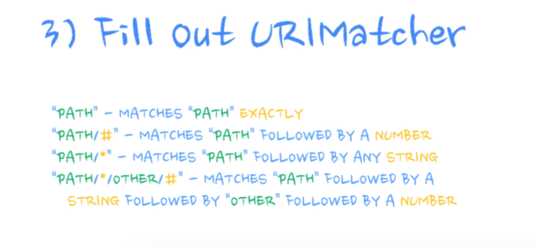

:title: Android Study Jam, Lesson 5
:author: Mario Bodemann
:css: lesson5.css

----

:data-x: 0
:data-y: 0
:data-z: 0
:data-rotate-y: 0

.. container:: main-title

  Android Study Jam: Lesson 5

.. container:: main-subtitle

  Rich and Responsive Layouts

.. image:: images/android_robot_200.png
   :height: 700

----

:data-x: 800
:data-y: r200
:data-z: -1000
:data-rotate-y: 72

Thanks to 
=========

.. image:: images/thoughtworks-logo.png

for this space
==============

----

:data-x: 400
:data-y: r200
:data-z: -1400
:data-rotate-y: 144

← Drinks/Toilet
===============

----

:data-x: -400
:data-y: r200
:data-z: -1400
:data-rotate-y: 216

WiFi password →
===============

----

:data-x: -800
:data-y: r200
:data-z: -1000
:data-rotate-y: 288

Hi, my name is *Mario*, and who are *you*?
==========================================

----

:data-rotate-y: 359
:data-x: 0
:data-y: 1200
:data-z: 0
:class: new-section

Lesson 4
========

Database, Content Provider, Resolver and Loader
-----------------------------------------------

----

:data-x: r1400
:data-y: r0
:data-z: r0
:data-rotate-y: 360

Summary
=======

.. image:: images/lesson4-summary.png
   :width: 1000px

----

Sqlite
======

.. image:: images/lesson4-databases.jpg  

----

Provider
========

.. image:: images/lesson4-content-provider-step-0.png  

----

----

.. image:: images/lesson4-content-provider-step-1.png  

----

.. image:: images/lesson4-content-provider-step-3.png  

----

Loader
======

.. image:: images/lesson4-loader.png

----

:data-rotate-y: 0
:class: new-section

Lesson 5
========

Rich and Responsive Layouts
---------------------------

----

.. image:: images/01-question.jpg 

Answer: *Sunshine*

----

.. image:: images/02-question.jpg

----

:class: code-slide

.. code:: java
    
  <?xml version="1.0" encoding="utf-8"?>
  <LinearLayout
    xmlns:android="http://schemas.android.com/apk/res/android"
    xmlns:tools="http://schemas.android.com/tools"
    android:layout_width="match_parent"
    android:layout_height="wrap_content"
    android:minHeight="?attr/listPreferredItemHeight"
    >

    <ImageView
        android:id="@+id/forecast_item_image"
        android:layout_width="wrap_content"
        android:layout_height="wrap_content"
        android:layout_gravity="center"
        android:contentDescription="@null"
        android:padding="10dp"
        tools:src="@android:drawable/star_big_on"
        />

----

:data-x: r-300
:data-y: r300
:data-rotate-y: -60
:data-scale: .2

----

:data-scale: 1
:data-x: r300
:data-y: r-300
:data-rotate-y: 0

----

:class: code-slide
:data-x: r1400

.. code:: java
    
    <LinearLayout
        android:layout_width="0dp"
        android:layout_height="wrap_content"
        android:layout_gravity="center"
        android:layout_weight="1"
        android:gravity="center"
        android:orientation="vertical"
        />

----

:class: code-slide

.. code:: java
    
        <TextView 
            android:id="@+id/forecast_item_date"
            android:layout_width="wrap_content"
            android:layout_height="wrap_content"
            android:layout_centerHorizontal="true"
            tools:text="tomorrow"
            />

        <TextView
            android:id="@+id/forecast_item_summary"
            android:layout_width="wrap_content"
            android:layout_height="wrap_content"
            tools:text="might be weather"
            />
    </LinearLayout>

----

:class: code-slide

Rinse and repeat
================

.. code:: java
    
    <LinearLayout
        android:layout_width="wrap_content"
        android:layout_height="wrap_content"
        android:layout_gravity="center"
        android:gravity="center"
        android:orientation="vertical"
        >

----

:class: code-slide

.. code:: java
    
        <TextView 
            android:id="@+id/forecast_item_temperature_max"
            android:layout_width="wrap_content"
            android:layout_height="wrap_content"
            android:gravity="center"
            tools:text="45 ℃"
            />

        <TextView 
            android:id="@+id/forecast_item_temperature_min"
            android:layout_width="wrap_content"
            android:layout_height="wrap_content"
            android:gravity="center"
            tools:text="10 ℃"
            />
    </LinearLayout>

  </LinearLayout>

----

.. image:: images/03-question.jpg

----

:class: code-slide

.. code:: java
   
  <?xml version="1.0" encoding="utf-8"?>
  <LinearLayout xmlns:android="http://schemas.android.com/apk/res/android"
    xmlns:tools="http://schemas.android.com/tools"
    android:layout_width="match_parent"
    android:layout_height="wrap_content"
    android:gravity="center"
    android:minHeight="150dp"> <!-- make it bigger -->

----

:class: code-slide

.. code:: java
   
   <!-- ... -->
        <TextView
            android:id="@+id/forecast_item_date"
            android:layout_width="wrap_content"
            android:layout_height="wrap_content"
            tools:text="tomorrow" />

        <TextView
            android:id="@+id/forecast_item_temperature_max"
            android:layout_width="wrap_content"
            android:layout_height="wrap_content"
            android:gravity="center"
            tools:text="45 ℃" />

        <TextView
            android:id="@+id/forecast_item_temperature_min"
            android:layout_width="wrap_content"
            android:layout_height="wrap_content"
            android:gravity="center"
            tools:text="10 ℃" />

----

:class: code-slide

.. code:: java
   
 <!-- ... -->
        <ImageView
            android:id="@+id/forecast_item_image"
            android:layout_width="wrap_content"
            android:layout_height="wrap_content"
            android:layout_gravity="center"
            android:contentDescription="@null"
            android:padding="10dp"
            tools:src="@android:drawable/star_big_on" />

        <TextView
            android:id="@+id/forecast_item_summary"
            android:layout_width="wrap_content"
            android:layout_height="wrap_content"
            tools:text="might be weather" />
 
----

.. image:: images/04-question.png

----

:class: code-slide

simply copy gists and change the following
------------------------------------------

.. code:: java

        /* Snipped, fill in more data if needed */

        // TODO Read weather description from cursor
        String description = cursor.getString(COL_WEATHER_DESC);
        TextView descriptionText = (TextView) 
                view.findViewById(R.id.forecast_item_summary);
        descriptionText.setText(description);

----

:class: code-slide

.. code:: java

  <resources 
    xmlns:xliff="http://schemas.android.com/apk/res-auto"
  >

----

----

:class: code-slide

.. code:: java

        final int layoutId;
        if (getItemViewType(cursor.getPosition()) 
                == VIEW_TYPE_TODAY) {
            layoutId = R.layout.list_item_forecast_today;
        } else {
            layoutId = R.layout.list_item_forecast;
        }

----

.. image:: images/06-question.jpg

----

:class: code-slide

.. code:: java 

    private static class ForecastItemHolder {
        public ImageView iconView;
        public TextView dateText;
        public TextView descriptionText;
        public TextView maxTextView;
        public TextView minTextView;

        public ForecastItemHolder(View view) {
            iconView = (ImageView) view.findViewById(R.id.forecast_item_image);
            dateText = (TextView) view.findViewById(R.id.forecast_item_date);
            descriptionText = (TextView) view.findViewById(R.id.forecast_item_summary);
            maxTextView = (TextView) view.findViewById(R.id.forecast_item_temperature_max);
            minTextView = (TextView) view.findViewById(R.id.forecast_item_temperature_min);

            view.setTag(this); // hmmm
        }
    }

----

:class: code-slide

.. code:: java 

    @Override
    public View newView(/* */) {
        final int layoutId;
        if (getItemViewType(cursor.getPosition()) 
                == VIEW_TYPE_TODAY) {
            layoutId = R.layout.list_item_forecast_today;
        } else {
            layoutId = R.layout.list_item_forecast;
        }

        View view = LayoutInflater.from(context).
                inflate(layoutId, parent, false);
        new ForecastItemHolder(view);
        return view;
    }

----

:class: code-slide

.. code:: java

        ForecastItemHolder itemView = 
                (ForecastItemHolder) view.getTag();

        // TODO Read weather description from cursor
        String description = cursor.getString(COL_WEATHER_DESC);
        itemView.descriptionText.setText(description);

----

----

:class: code-slide

.. code:: java

  // XML:
  <string name="format_temperature">
        <xliff:g id="temp">%1.0f</xliff:g> 
        <xliff:g id="unit"> \u00B0%2$s</xliff:g>
  </string>

  // JAVA:
  return context.getString(R.string.format_temperature, 
        temperature, 
        isMetric ? "C" : "F");

----

----

:class: code-slide

.. code:: java

            <TextView
                android:id="@+id/detail_item_date"
                android:layout_width="wrap_content"
                android:layout_height="wrap_content"
                tools:text="tomorrow" />

            <TextView
                android:id="@+id/detail_item_temperature_max"
                android:layout_width="wrap_content"
                android:layout_height="wrap_content"
                android:gravity="center"
                tools:text="45 ℃" />

            <TextView
                android:id="@+id/detail_item_temperature_min"
                android:layout_width="wrap_content"
                android:layout_height="wrap_content"
                android:gravity="center"
                tools:text="10 ℃" />

            <TextView
                android:id="@+id/detail_item_humidity"
                android:layout_width="wrap_content"
                android:layout_height="wrap_content"
                android:gravity="center"
                tools:text="85%" />

            <TextView
                android:id="@+id/detail_item_wind"
                android:layout_width="wrap_content"
                android:layout_height="wrap_content"
                android:gravity="center"
                tools:text="155 km/h NNW" />

            <TextView
                android:id="@+id/detail_item_pressure"
                android:layout_width="wrap_content"
                android:layout_height="wrap_content"
                android:gravity="center"
                tools:text="1014 hPa" />

----

:class: code-slide

OnCreate(…)
-----------

.. code:: java
        
        mTextDate = (TextView) findViewById(R.id.…);
        mTextTemperatureMax = (TextView) findViewById(…);
        mTextTemperatureMin = (TextView) findViewById(…);
        mTextImage = (ImageView) findViewById(R.id.…);
        mTextSummary = (TextView) findViewById(R.id.…);
        mTextHumidity = (TextView) findViewById(R.id.…);
        mTextWind = (TextView) findViewById(R.id.…);
        mTextPressure = (TextView) findViewById(R.id.…);

----

:class: code-slide

.. code:: java
        

    final String[] PROJECTION = new String[]{
            WeatherEntry.COLUMN_DATE,
            WeatherEntry.COLUMN_WEATHER_ID,
            WeatherEntry.COLUMN_SHORT_DESC,
            WeatherEntry.COLUMN_MAX_TEMP,
            WeatherEntry.COLUMN_MIN_TEMP,
            WeatherEntry.COLUMN_PRESSURE,
            WeatherEntry.COLUMN_WIND_SPEED,
            WeatherEntry.COLUMN_DEGREES,
            WeatherEntry.COLUMN_HUMIDITY,
    };

----

:class: code-slide

.. code:: java
        
    final int DATE_INDEX = 0;
    final int CONDITION_INDEX = 1;
    final int SUMMARY_INDEX = 2;
    final int TEMPERATURE_MAX_INDEX = 3;
    final int TEMPERATURE_MIN_INDEX = 4;
    final int PRESSURE_INDEX = 5;
    final int WIND_SPEED_INDEX = 6;
    final int WIND_DIRECTION_INDEX = 7;
    final int HUMIDITY_INDEX = 8;

----

:class: code-slide

onLoadFinished(…)
-----------------

.. code:: java

        boolean isMetric = Utility.isMetric(this);

        int condition = cursor.getInt(CONDITION_INDEX);

        mTextDate.setText(Utility.getDayName(this, 
                cursor.getLong(DATE_INDEX)));
        mTextSummary.setText(cursor.getString(
                SUMMARY_INDEX));

        mTextTemperatureMax.setText(Utility.formatTemperature(…))

        mTextPressure.setText(Utility.formatPressure(…)));
        mTextWind.setText(Utility.getFormattedWind(…)));
        mTextHumidity.setText(Utility.formatHumidity(…)));
        

----

----

----

----

:class: code-slide

ForecastAdapter
===============

.. code:: java  

        int weatherId = cursor.getInt(COL_WEATHER_CONDITION_ID);
        int weatherIcon;
        if (getItemViewType(cursor.getPosition()) 
                == VIEW_TYPE_TODAY) {
            weatherIcon = 
                getArtResourceForWeatherCondition(weatherId);
        } else {
            weatherIcon = 
                getIconResourceForWeatherCondition(weatherId);
        }
        
        itemView.iconView.setImageResource(weatherIcon);

----

:class: code-slide

DetailsActivity/Fragment
========================

.. code:: java  

        int condition = cursor.getInt(WEATHER_CONDITION_ID);
        mImage.setImageResource(
                getArtResourceForWeatherCondition(
                        condition)
        );

----

.. image:: images/11-question.jpg

----

* Increased Complexity
* Harder Intent Handling
* Difficult to read, maintain and test
* Risk of tight coupling
* Some security concerns

----

:data-x: r1400
:data-y: r0
:data-z: 0

----

:data-y: r750

.. image:: images/activity_fragment_lifecycle.png
   :height: 2000px

----

:data-y: r750

----

:data-x: r1400
:data-y: r-1500

.. image:: images/12-question.jpg

----

:data-x: r1400
:data-y: r0

Answers
-------

Tag was ambigious: *fragmentTag* or **backstackTag**?

#. fm.beginTransaction();
#. ft.addToBackStack(**tag**);
#. ft.replace(containerID, fragB);
#. ft.commit();

----

----

----

----

:class: code-slide

activity_main@tablet
--------------------

.. code:: java  

  <LinearLayout> 
 
    <fragment
        android:id="@+id/fragment_forecast"
        android:name="{…}.ForecastFragment"
        android:layout_width="0dp"
        android:layout_height="match_parent"
        android:layout_weight="2"
        tools:layout="@android:layout/list_content" />
 
    <FrameLayout
        android:id="@+id/weather_detail_container"
        android:layout_width="0dp"
        android:layout_height="match_parent"
        android:layout_weight="4" />
 
  </LinearLayout>a

----

:data-x: r-220
:data-y: r350
:data-scale: .05

----

:data-scale: 1
:data-x: r220
:data-y: r-350

----

:data-x: r1400
:data-y: r0

:class: code-slide

activity_main@phone
-------------------

framelayout instead of fragment due to arguments needed
~~~~~~~~~~~~~~~~~~~~~~~~~~~~~~~~~~~~~~~~~~~~~~~~~~~~~~~

.. code:: java  

  <FrameLayout
    xmlns:android="http://schemas.android.com/apk/res/android"
    xmlns:tools="http://schemas.android.com/tools"
    android:id="@+id/weather_detail_container"
    android:layout_width="match_parent"
    android:layout_height="match_parent"
    tools:layout="@layout/fragment_detail"
    />  

----

:class: code-slide

MainActivity.java
-----------------

.. code:: java  

    @Override
    protected void onCreate(Bundle savedInstanceState) {
        super.onCreate(savedInstanceState);
        if (findViewById(R.id.container) != null) {
          if (savedInstanceState == null) {
              Fragment fragment = new DetailFragment();
              getSupportFragmentManager()
                     .beginTransaction()
                     .replace(R.id.container, fragment)
                     .commit();
        }
      }
    }

----

.. image:: images/15-question.jpg

----

:class: code-slide

ForecastFragment.java
~~~~~~~~~~~~~~~~~~~~~

.. code:: java

    public static interface ForecastCallback {
        void onForecastItemClicked(Cursor cursor);
    }

----

:class: code-slide

.. code:: java
                
 new OnItemClickListener() {
  public void onItemClick(…) {
    if (getActivity() instanceof ForecastCallback) {
      final Cursor cursor = 
        (Cursor) mForecastAdapter.getItem(position);
        ((ForecastCallback) getActivity())
          .onForecastItemClicked(cursor);
      }
    }
 }

----

:class: code-slide

MainActivity.java
~~~~~~~~~~~~~~~~~

.. code:: java
                
  public class MainActivity 
    extends ActionBarActivity 
    implements ForecastCallback {

    // …

    @Override
    public void onForecastItemClicked(Cursor cursor) {
        final Uri uri = getCurrentSelectedItemUri(cursor);

        if (isInTwoPanelMode()) {
            replaceDetailFragment(uri);
        } else {
            startDetailsActivity(uri);
        }
    }
    }

----

:class: code-slide

.. code:: java
                
    private void replaceDetailFragment(Uri uri) {
        DetailFragment fragment = 
                DetailFragment.instanciate(uri);
        getSupportFragmentManager()
                .beginTransaction()
                .addToBackStack(DetailFragment.TAG)
                .replace(R.id.weather_detail_container, 
                        fragment, 
                        DetailFragment.TAG)
                .commit();
    }

----

:class: code-slide

.. code:: java
   
    private void startDetailsActivity(Uri uri) {
        final Intent intent = new Intent(
                getApplicationContext(),
                DetailActivity.class);
        intent.setData(uri);
        startActivity(intent);
    }

----

----

:class: code-slide

values/styles.xml
~~~~~~~~~~~~~~~~~~~~~~

.. code:: java

  <resources>
    
  </resources>

----

:class: code-slide

layout/fragment_main.xml
~~~~~~~~~~~~~~~~~~~~~~~~

.. code:: java

   <FrameLayout … >

    <ListView
        android:id="@+id/forecast_list_view"
        …
        style="@style/sunshine_list_style"
        />

  </FrameLayout>

----

----

:class: code-slide

onSaveInstanceState()
~~~~~~~~~~~~~~~~~~~~~

@ForecastFragment
.................

.. code:: java

    @Override
    public void onSaveInstanceState(Bundle outState) {
        outState.putInt(
                LAST_KNOWN_POSITION, 
                mLastKnownPosition);

        super.onSaveInstanceState(outState);
    }

----

:class: code-slide

onCreateView()
~~~~~~~~~~~~~~

@ForecastFragment.java
......................

.. code:: java

        if (savedInstanceState != null ) {
            mLastKnownPosition = 
                savedInstanceState.getInt(
                   LAST_KNOWN_POSITION, -1);
        }

        if (mLastKnownPosition > -1) {
            mListView.smoothScrollToPosition(
                mLastKnownPosition);
        }

----

.. image:: images/18-question.jpg

----

----

----

Skipping, to not limit your creativity ... 
==========================================

----

----

:class: code-slide

Quiz
====

What does this do?
==================

.. code:: java

        mForecastAdapter
          .setShouldHighlightTodayItem(
            getResources()
              .getBoolean(R.bool.highlight_today)
          );

----

Answer
======

Using different value-* folders for boolean

.. code:: java

 <?xml version="1.0" encoding="utf-8"?>
 <resources>
    <bool name="highlight_today">false</bool>
 </resources>

----

.. image:: images/21-question.png

----

Some copy paste later …
=======================

----

----

----

----

----

----

.. image:: images/26-answer.png

----

.. image:: images/27-question.jpg

----

Done creating my view ...
=========================

----

:data-x: r0
:data-y: r0
:data-z: 3000
:data-rotate-x: 30
:data-rotate-y: 75
:data-rotate-z: 30

**Done.**
=========

Questions???
------------

