:title: Android Study Jam, Lesson 6: Services and Notifications
:author: Mario Bodemann
:css: lesson6.css

----

:data-x: 0
:data-y: 0
:data-z: 0
:data-rotate-y: 0

.. container:: main-title

  Android Study Jam: Lesson 6

.. container:: main-subtitle

  Services and Notifications

.. image:: images/android_robot_200.png
   :height: 700

----

:data-x: 800
:data-y: r200
:data-z: -1000
:data-rotate-y: 72

Thanks to 
=========

.. image:: images/thoughtworks-logo.png

for this space
==============

----

:data-x: 400
:data-y: r200
:data-z: -1400
:data-rotate-y: 144

← Drinks/Toilet
===============

----

:data-x: -400
:data-y: r200
:data-z: -1400
:data-rotate-y: 216

WiFi password →
===============

----

:data-x: -800
:data-y: r200
:data-z: -1000
:data-rotate-y: 288

Hi, my name is *Mario*, and who are *you*?
==========================================

----

:data-rotate-y: 359
:data-x: 0
:data-y: 1200
:data-z: 0
:class: new-section

Lesson 5
========

Rich and Responsive Layouts 
---------------------------

----

:data-rotate-y: 0
:data-x: r1600
:class: new-section

Lesson 6
========

Services and Notifications
--------------------------

----

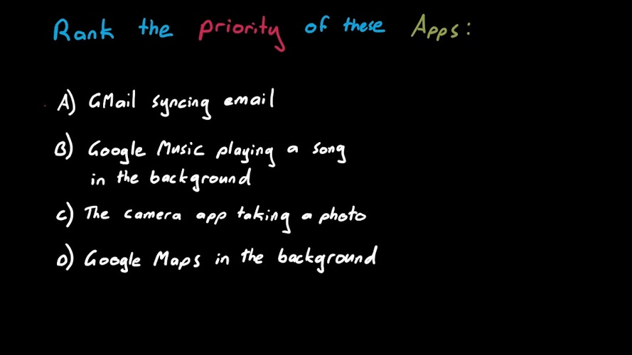

----

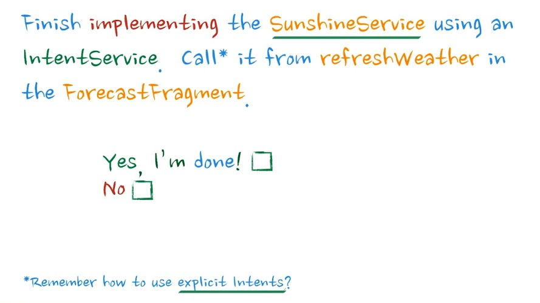

----

Using the new class approach or using 
a **new service** which already has 
most of the functionallity introduced
later.

----

:class: code-slide

*SunshineService.java* (merged with *FetchWeatherTask*)

.. code:: java

  public class SunshineService extends IntentService {
    public SunshineService() {
        super("SunshineService");
    }

     @Override
    protected void onHandleIntent(Intent intent) {
        if (intent != null && 
            intent.hasExtra(LOCATION_EXTRA)) {
            doInBackground(
                intent.getStringExtra(LOCATION_EXTRA));
        }
    }

    protected void doInBackground(String location) {
        if (TextUtils.isEmpty(location)) {
            return;
        }
   }
 } 

----

:class: code-slide

ForecastFragment.java

.. code:: java

    private void updateWeather() {
      final Intent service = new Intent(
        this, 
        SunshineService.class);
      service.putExtra(
        SunshineService.LOCATION_EXTRA, 
        getPreferredLocation());
     startService(service);
  }

----

:class: code-slide

AndroidManifest.xml

.. code:: java

        <service
            android:name=".service.SunshineService"
            android:exported="false" >
        </service>

----

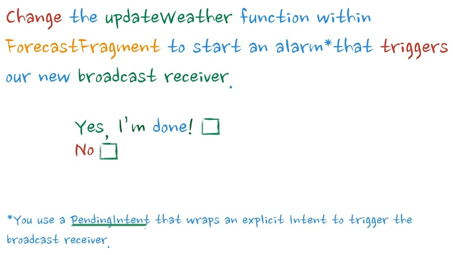

----

:class: code-slide

AndroidManifest.java

.. code:: java

      <manifest 
        xmlns:android="http://schemas.android.com/apk/res/android"
        package="com.example.sunshine" > // !!!!!!!!!!

        <receiver 
          android:name=".service.SunshineService$AlarmReceiver" 
          android:enabled="true" // !!!!!!
        />

----

:class: code-slide

SunshineService.java

.. code:: java

    public static class AlarmReceiver 
                extends BroadcastReceiver {
        @Override
        public void onReceive(Context context, 
                              Intent intent) {
            final Intent serviceIntent = new Intent(
                context, SunshineService.class);
            serviceIntent.putExtra(LOCATION_EXTRA, 
                intent.getStringExtra(LOCATION_EXTRA));
            context.startService(serviceIntent);
        }
    }
  
----

:class: code-slide

ForecastFragment.java

.. code:: java

        final Intent alarmIntent = new Intent(
                this, 
                SunshineService.AlarmReceiver.class);
        alarmIntent.putExtra(
                SunshineService.LOCATION_EXTRA, 
                getPreferredLocation());

        final PendingIntent pending = 
                PendingIntent.getBroadcast(
                        this, 0, alarmIntent,
                        PendingIntent.FLAG_ONE_SHOT);

        final AlarmManager alarmManager = 
                (AlarmManager) getSystemService(
                        Context.ALARM_SERVICE);
        alarmManager.set(AlarmManager.RTC_WAKEUP, 
                         System.currentTimeMillis() + 5 * 1000, 
                         pending);

----

.. image:: images/04-question.jpg

----

----

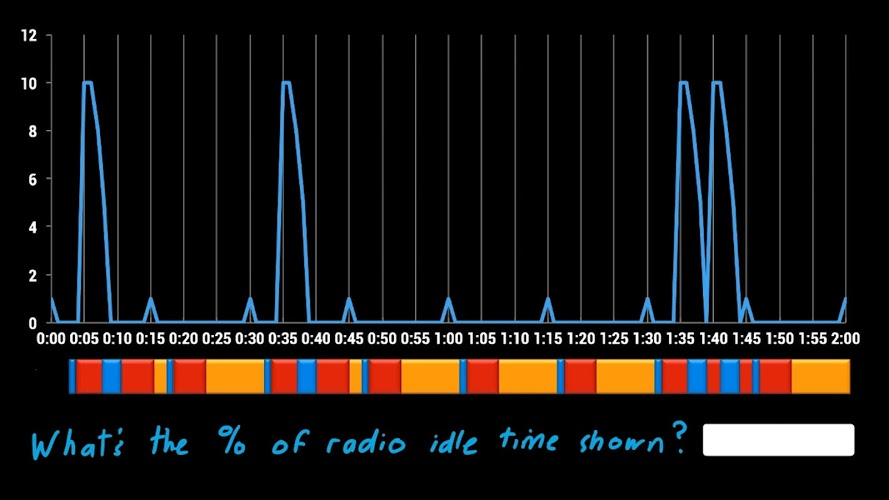

----

----

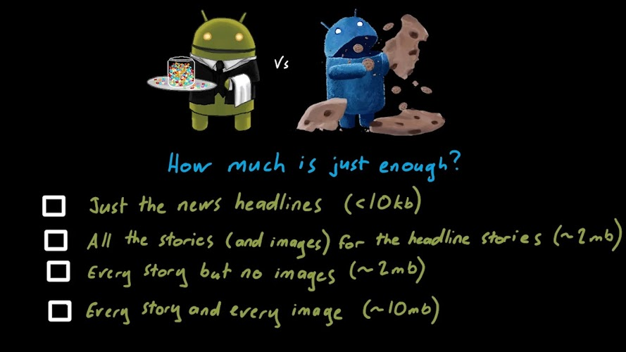

----

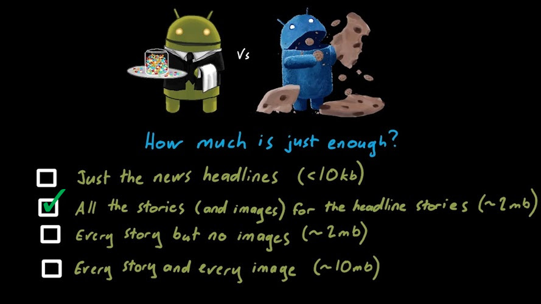

----

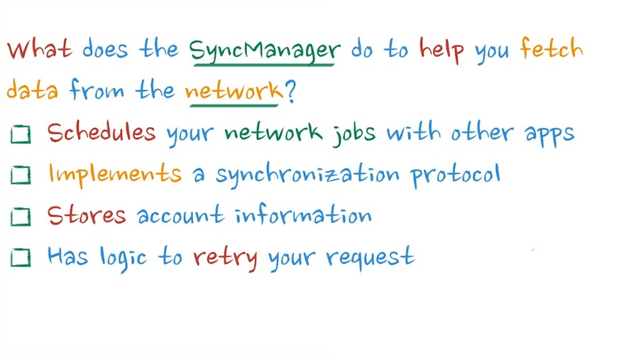

----

----

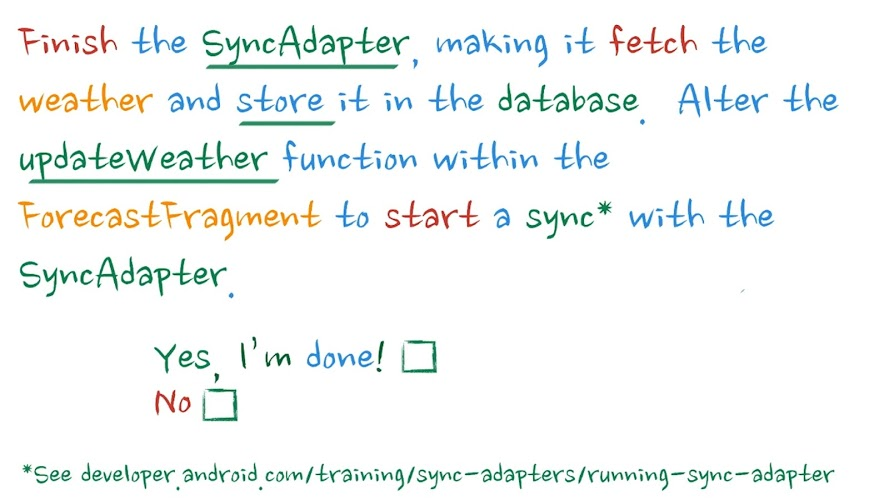

----

:class: code-slide

ForecastFragment.java

.. code:: java

    private void updateWeather() {
        SunshineSyncAdapter.syncImmediately(this);
    }

----

:class: code-slide

ForecastFragment.java

.. code:: java

    @Override
    public void onPerformSync(…) {
        String location = getPreferredLocation(getContext());
        if (TextUtils.isEmpty(location)) {
            return;
        }

        // … rest comes from onHandleIntent from Reciever
   }

----

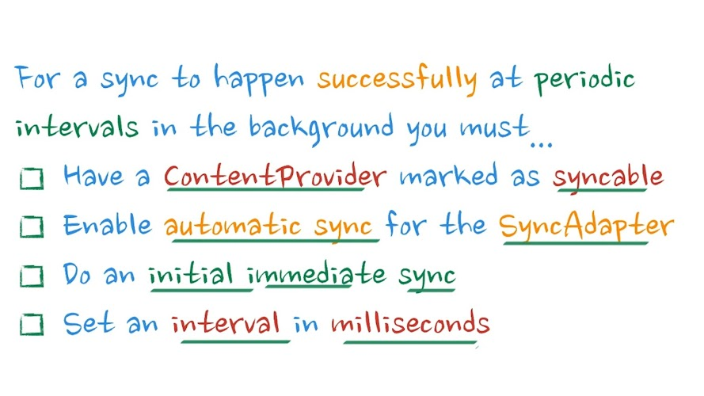

----

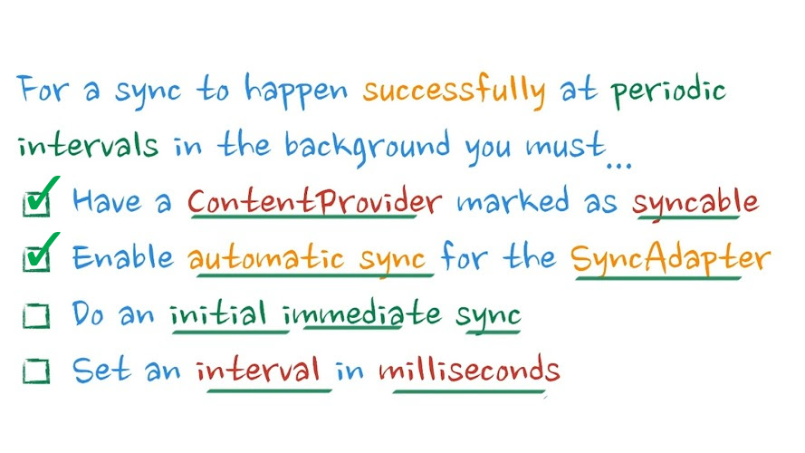

Remember: Interval is set in seconds, not milliseconds

----

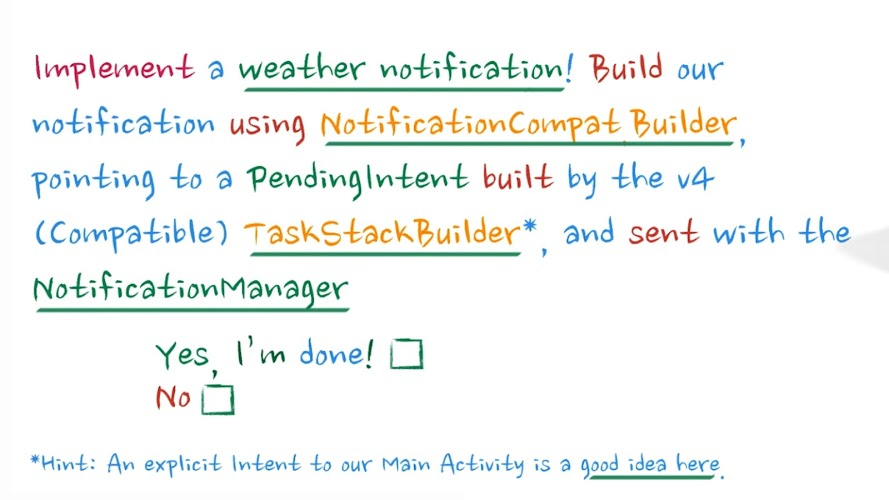

----

:class: code-slide

.. code:: java

        NotificationCompat.Builder mBuilder =
                new NotificationCompat.Builder(getContext())
                        .setSmallIcon(iconId)
                        .setContentTitle(title)
                        .setContentText(text);
                // set color anyone?

----

:class: code-slide

.. code:: java

        Intent resultIntent = new Intent(
                getContext(), MainActivity.class);
        TaskStackBuilder stackBuilder = 
                TaskStackBuilder.create(getContext());
        stackBuilder.addNextIntent(resultIntent);
        PendingIntent resultPendingIntent =
                stackBuilder.getPendingIntent(
                        0,
                        PendingIntent.FLAG_UPDATE_CURRENT
                );
        mBuilder.setContentIntent(resultPendingIntent);

----

:class: code-slide

.. code:: java

        NotificationManager notificationManager =
                (NotificationManager) getContext().
                getSystemService(Context.NOTIFICATION_SERVICE);
        
        notificationManager.notify(WEATHER_NOTIFICATION_ID, 
                mBuilder.build());

----

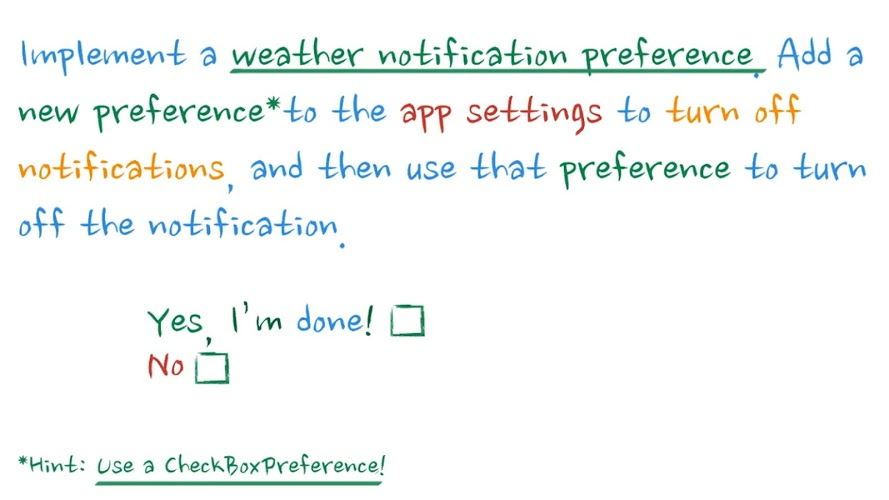

HINT: Not so good practice to reimplement platform behaviour! (See app settings, disable notifications ...)

----

:class: code-slide

preferences.xml

.. code:: java

        
    <CheckBoxPreference
        android:id="@+id/preference_enable_notification"
        android:defaultValue="true"
        android:key="@string/preference_enable_notification_key"
        android:title="@string/prefernce_enable_notification_title" />

----

:class: code-slide

SunshineSyncAdapter.java@buildNotification

.. code:: java

        final Context context = getContext();
        final SharedPreferences prefs = PreferenceManager.
                getDefaultSharedPreferences(context);
        final String key = context.getString(
                R.string.preference_enable_notification_key);
        final boolean defaultValue = context.getResources().
                getBoolean(R.bool.preference_enable_notification_default);
        final boolean notificationsEnabled = prefs.getBoolean(
                key, defaultValue);
        
        if (!notificationsEnabled) {
            return;
        }

----

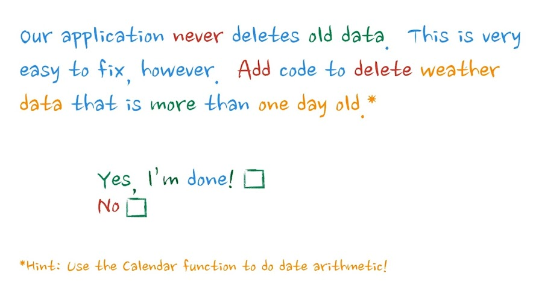

----

:class: code-slide

SunshineSyncAdapter.java@buildNotification

.. code:: java

               final Calendar calendar = Calendar.getInstance();
               calendar.add(Calendar.DATE, -1);
               final String yesterdayDate = 
                  WeatherContract.getDbDateString(calendar.getTime());
               getContext().getContentResolver()
                        .delete(WeatherEntry.CONTENT_URI,
                                WeatherEntry.COLUMN_DATETEXT + " <= ?",
                                new String[] {yesterdayDate});

----

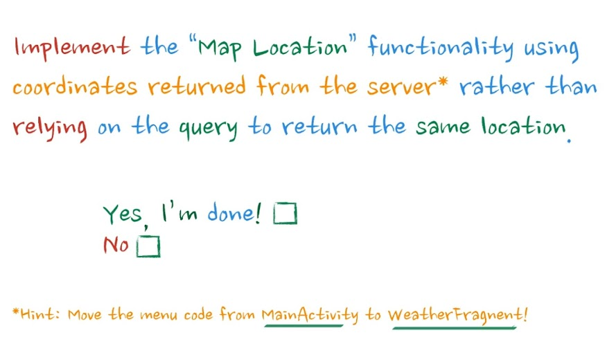

ProHint: WeatherFragment = ForecastFragment ... >)

----

:class: code-slide

Moving Action code from MainActivity to WeatherFragment

.. code:: java

    private void verifyLocation() {
        final Cursor todaysCursor = mForecastAdapter
                .getCursor();
        if (todaysCursor != null) {
            todaysCursor.moveToFirst();
            final double latitude = todaysCursor
                .getDouble(COL_COORD_LAT);
            final double longitutde = todaysCursor
                .getDouble(COL_COORD_LONG);
            final Intent intent = new Intent(
                Intent.ACTION_VIEW,
                    Uri.parse("geo:" + latitude + 
                        "," + longitutde));
            // … check for intent app 
        }
    }

----

:data-x: r0
:data-y: r0
:data-z: 3000
:data-rotate-x: 30
:data-rotate-y: 75
:data-rotate-z: 30
:class: new-section

**Done. YOU ARE GREAT**
=======================

Now celebrate, what was your own project about?
-----------------------------------------------

