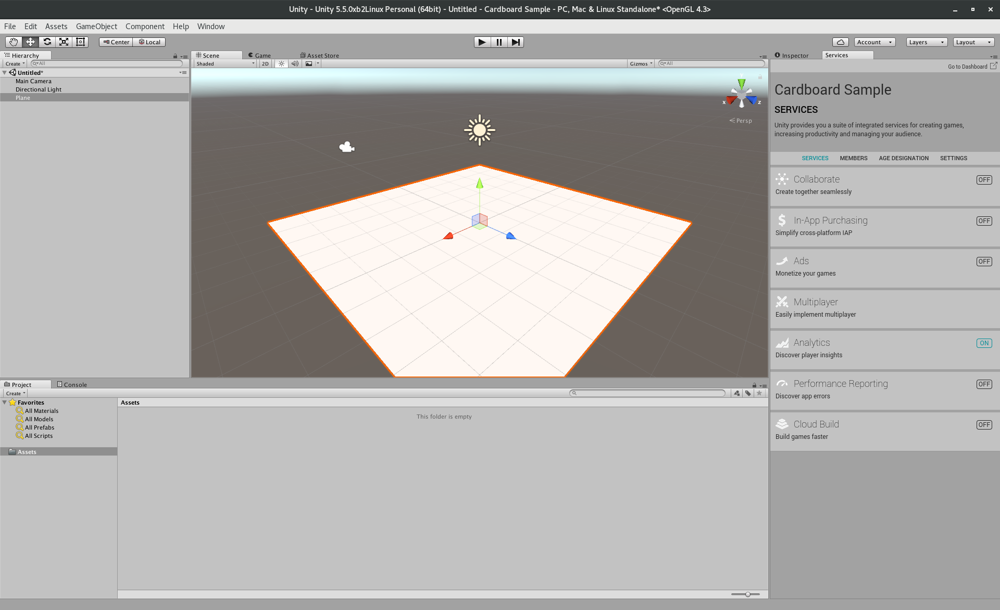
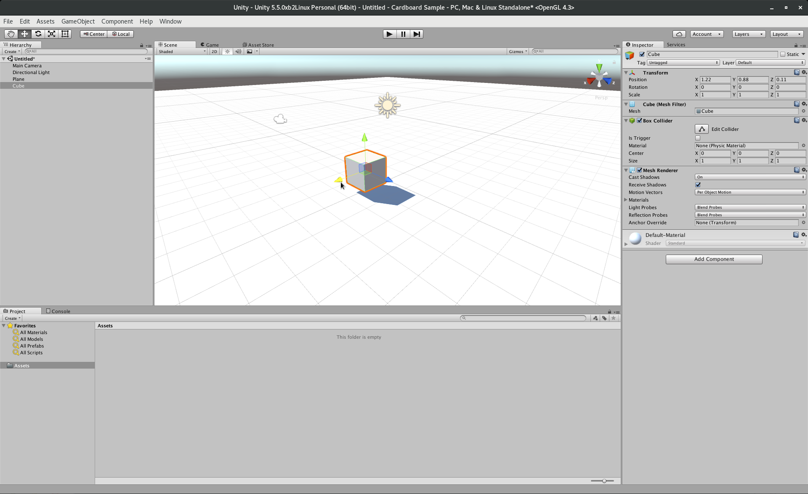
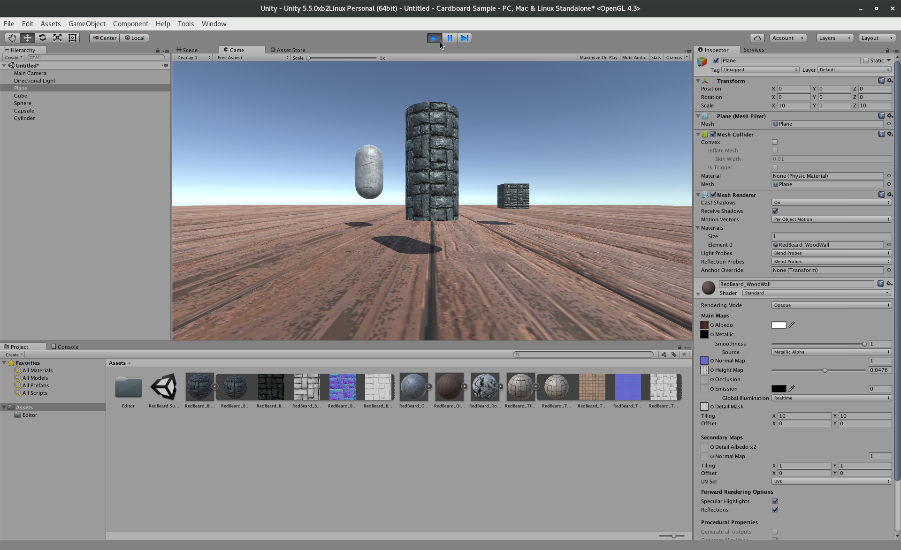
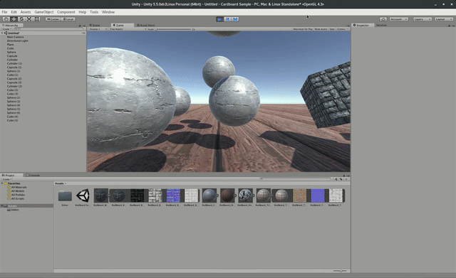
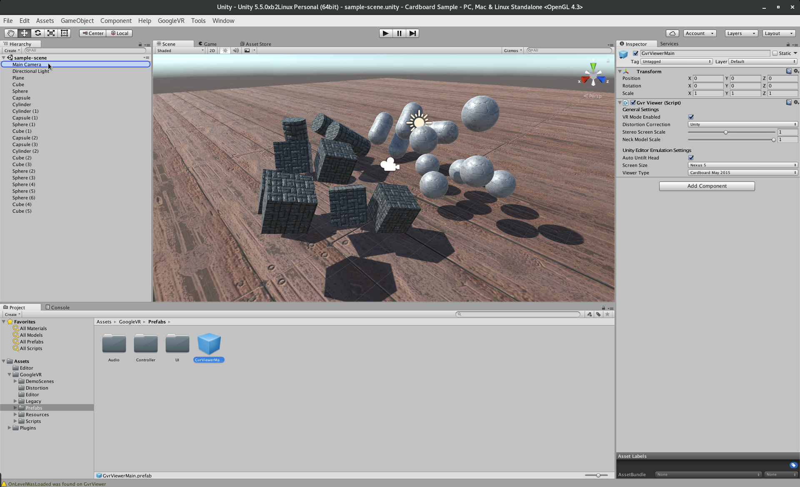

:title: Daydreaming about Cardboards or Virtual Realtiy in Android
:author: Mario Bodemann
:css: daydream.css
:skip-help: true
:data-transition-duration: 0

----

:class: hide-background

.. container:: main-title

  Daydreaming about Cardboards

.. container:: main-subtitle

  Virtual Reality in Android

----

:data-x: r2000

.. image:: images/contentful.png
   :width: 500px

* 🔧: headless CMS: `contentful.com <http://contentful.com/>`_
* 🐦: `@MarioBodemann <http://twitter.com/@MarioBodemann>`_
* 📄: `bit.ly/mbvrbln <http://bit.ly/mbvrbln>`_

  * Please interrupt `👄👅 <http://blah.de/>`_!

.. note::
   * Please follow the slides at the given address.
   * Wait some seconds to see if someone is writing down the address...
   
   Audience
   
   * ``Android programmer? 👋``
   * ``VR programmer? 👋``

----

:data-x: -1000
:data-y: 1800
:data-z: 1000
:data-scale: 4
:class: hide-background

Agenda
======

----

:data-x: 0
:data-y: 1300
:data-z: 0
:data-rotate-x: 0
:data-rotate-y: 0
:data-rotate-z: 0
:data-scale: 1

:class: new-section

.. image:: images/daydream-logo.png
   :class: center-image
   :width: 1000px 

.. note::

        * Introduced at Google I/O this year.
        * Soon™ first hardware available.

----

:data-x: r2000
:data-y: r0

Google Daydream
---------------

* based on Google Cardboard
* light weight
* in different styles/interactions
* *You just need a phone™*

----

----

:class: hide-background
:data-x: r-275
:data-y: r175
:data-scale: 0.2

.. note::
   Controller

   * uses special hardware as controller

     * can get emulated by any Android phone (>= 4.4)
     * has four Buttons: Volume +/-, App(Programmable), Home
     * clickable Touchpad. (x/y position, clicked state)(emulated by two touches)

   * Print out sheet to not get to disctracted by Phone
   * Connects via bluetooth to ``Headset Phone``

----

:class: hide-background
:data-x: r80
:data-y: r-300
:data-scale: 0.4

.. note::
   Headset Phone

   * has to be a ``Nexus 6P`` running ``Android Nougat``
   * start a Daydream app once, set it up by clicking on the ``Gear``, enabling all VR settings
   * ``Reboot phone ...`` ;) .
   * Bluetooth to connect to controller.

----

:class: hide-background
:data-x: r195
:data-y: r125

:data-scale: 1.0

.. note::
   Complete Package

   * ``Daydream Ready``

     * high performance sensors for high accuracy head tracking
     * displays with fast response time to minimize blur
     * powerfull mobile processor
     * VR System notifications

   * will be available ``in fall``
   * will be created by hardware partners
   * certified by ``Google``
   * Google Play for VR and ``Daydream Home``

----

:data-x: r2000
:data-y: r0
:data-scale: 1

How does Daydream work?
-----------------------

* use 3D data, rendering two images

  * one for the left and right eye

* brain combines image to 3D scene

----

.. image:: images/contentful-vr-bunny.gif
   :class: center-image

----

How do you program it?
----------------------

GoogleVR SDK are available for

* Android (OpenGL)
* iOS (Objective C)
* Unreal Engine (*NEW*)
* Unity Engine (C# /JS) x (🍎, G,💻, 🐧)

----

What do those SDKs provide?
---------------------------

* lens distortion correction
* spatial audio
* head tracking
* 3D calibration
* side-by-side rendering

----

What else do they provide?
--------------------------

* stereo geometry configuration
* user input event handling
* see `https://vr.google.com/developers/ <https://vr.google.com/developers/>`_

----

:data-x: 0
:data-y: r1300

:class: new-section

.. image:: images/unity-editor-icon.png
   :class: center-image

----

:data-x: r2000
:data-y: r0

Google Daydream Technical Preview

 * `special preview build from unity <https://unity3d.com/partners/google/daydream>`_
 * Out of the box, basic functionality

*or* Google VR Plugin

 * Installer for Unity on `🍎+💻 <https://store.unity.com/>`_ (or `🐧 <http://forum.unity3d.com/threads/unity-on-linux-release-notes-and-known-issues.350256/>`_)
 * `Plugin <https://github.com/googlevr/gvr-unity-sdk>`_ gives full controller support and more
        
----

:data: new-section

Unity demo
==========

----

:class: hide-background

.. image:: images/unity-demo-new-project.png
   :class: center-image

.. note::
   Create a new Project

----

:class: hide-background

.. image:: images/unity-demo-new-project-wizard.png
   :class: center-image

.. note::
   Name it

----

:class: hide-background

.. image:: images/unity-demo-empty.png
   :class: center-image-huge

.. note::
   See it

----

:data-x: r0
:data-y: r-100
:data-scale: .6
:class: hide-background

.. note::
   Main stage: see everything important happening here

----

:data-x: r2000
:data-y: r100
:data-scale: 1
:class: hide-background

.. image:: images/unity-demo-new-plane-menu.png
   :class: center-image-huge

.. note::
   Populate stage: Add a plane

----

:data-x: r-500
:data-y: r-350
:data-scale: .3
:class: hide-background

.. note::
   Menu > GameObject > 3D Object > Plane

----

:data-x: r2500
:data-y: r350
:data-scale: 1
:class: hide-background

.. note::
   Show GameObject Plane

----

:data-x: r2000
:data-y: r0
:data-scale: 1
:class: hide-background

.. image:: images/unity-demo-inspector.png
   :class: center-image-huge

.. note::
   Open inspector on righthand side

----

:data-x: r650
:data-y: r-200
:data-scale: .4
:class: hide-background

.. note::
   Search for ``Inspector >  Transform > Scale``

----

:data-x: r1350
:data-y: r200
:data-scale: 1
:class: hide-background

.. image:: images/unity-demo-plane-scaled.png
   :class: center-image-huge

.. note::
   * See size changed to be screen filling.
   * Let's make it more exciting > more objects!

----

:data-x: r2000
:data-y: r0
:class: hide-background

.. image:: images/unity-demo-new-objects-menu.png
   :class: center-image-huge

.. note::
   Let's add more objects

----

:data-x: r2000
:data-y: r0
:class: hide-background

.. image:: images/unity-demo-cube-added.png
   :class: center-image-huge

.. note::
   A Cube appears

----

:class: hide-background

.. note::
   Move that cube.

----

:data-x: r-50
:data-y: r-150
:data-scale: 0.25
:class: hide-background

.. note::
   Take a look where the mouse cursor is pointing at.

----

:data-x: r2050
:data-y: r150
:data-scale: 1
:class: hide-background

.. note::
   Adding one of each: Cube/Sphere/Cylinder/Capsule

----

:data-x: r350
:data-y: r50
:data-scale: 0.25
:class: hide-background

.. note::
   Take a look at the camera preview: It does not look to colourfull. Let's change that.

----

:data-x: r1650
:data-y: r-50
:data-scale: 1
:class: hide-background

.. image:: images/unity-demo-assets.png
   :class: center-image-huge

.. note::
   Overview of next steps: Let's add materials.

----

:data-x: r-775
:data-y: r200
:data-scale: 0.2
:class: hide-background

.. note::
   Click on ``Favorites\All Material``

----

:data-x: r400
:data-y: r-50
:data-scale: 0.15
:class: hide-background

.. note::
   Click on ``Asset Store``

----

:data-x: r0
:data-y: r100
:class: hide-background

.. note::
   Click on an asset which is interesting/looks nice (``RedBeard_Bluestone WallV2``)

----

:data-x: r1000
:data-y: r-500
:data-scale: 0.5
:class: hide-background

.. note::
   * Check ``Asset count``: Defines how many different materials are included. the more the nicer looking.
   * Hit ``Import package``.

----

:data-x: r1375
:data-y: r150
:data-scale: 1
:class: hide-background

.. note::
   Hit ``import`` after checking all checkmarks (should already be the case)

----

:data-x: r2000
:data-y: r0
:class: hide-background

.. image:: images/unity-demo-multi-assign-material.png
   :class: center-image-huge

.. note::
   No change, we have to assign the material to different objects.

----

:data-x: r-150
:data-y: r-200
:data-scale: .3
:class: hide-background

.. note::
   Use SHIFT to click select multiple objects.

----

:data-x: r900
:data-y: r0
:class: hide-background

.. note::
   Hit the little hidden button next to ``Inspector > ✓ Mesh Renderer > Materials > Element 0 > Default Material … ○``

----

:data-x: r-1250
:data-y: r375
:class: hide-background

.. note::
   * Select a material to be used.
   * Repeat for all objects.

----

:data-x: r2500
:data-y: r-175
:data-scale: 1
:class: hide-background

.. image:: images/unity-demo-multi-material.png
   :class: center-image-huge

.. note::
   Looks nice, let's ``run`` it.

----

:data-x: r2000
:data-y: r-450
:data-scale: 0.2
:class: hide-background

.. note::
   * Run the current program to see what the user would see.
   * (comparable to deploying  it to an emulator, checking before deploying to phone)

----

:data-x: r0
:data-y: r450
:data-scale: 1
:class: hide-background

.. note::
   Looks nice, but there is nothing happening, let's change that!

----

:data-x: r2000
:data-y: r0
:class: hide-background

.. image:: images/unity-demo-rigid-menu.png
   :class: center-image-huge

.. note::
   Overview of adding a ``gravity`` animation

----

:data-x: r0
:data-y: r-270
:data-scale: 0.2
:class: hide-background

.. note::
   * Select all gravityable objects using SHIFT and left mouse click. 
   * Do not add the plane, since the other objects need something to ``land`` on.

----

:data-x: r-450
:data-y: r-100
:data-scale: 0.5
:class: hide-background

.. note::
   Add ``gravity`` to all selected objects by hitting menu option ``Component > Physics > Rigidbody``.

----

:data-x: r2450
:data-scale: 0.3
:class: hide-background

.. note::
   Hit play.

---- 

:data-x: r0
:data-y: r470
:data-scale: 1.0
:class: hide-background

.. note::
   * Show stupidly simple animation
   * Nice, but we can do more ....

----

:data-x: r2000
:data-y: r-70
:data-scale: 1
:class: hide-background

.. image:: images/unity-demo-rigid-complex.png
   :class: center-image-huge

.. note::
   * Copying objects by using ``Copy and Paste``
   * Also: I moved the camera inside of the action

----

:data-y: r0

:class: hide-background

.. note::
   * Now with fancy interactions and animations.
   * Cannot see the other parts, lets use a cardboard! :)

----

:class: hide-background

.. note::
   Import the Unity package by going to Assets > Import Package > Custom Package.

----

:data-x: r-600
:data-y: r-300
:data-scale: 0.4
:class: hide-background

.. note::
   zoomed in view

----

:data-x: r2600
:data-y: r300
:data-scale: 1
:class: hide-background

.. image:: images/unity-demo-add-gvr-dialog.png
   :class: center-image

.. note::
   * Find the checked out folder from step 1
   * Select the ``GoogleVRForUnity.unitypackage``
   * Hit ``Open``.
   * Wait

----

:data-x: r2000
:data-y: r0
:class: hide-background

.. note::
   Select ``all`` and hit ``ok`` again. You have now the complete sdk imported.

----

:data-x: r2000
:class: hide-background

.. note::
   Please wait ... ;)

----

:class: hide-background

.. note::
   * Updating is fine for simple projects, more complex might be an issue.
   * ``I Made a Backup. Go Ahead!``

----

:class: hide-background

.. image:: images/unity-demo-add-gvr-add-gvrmainviewer.png
   :class: center-image-huge

.. note::
   * Sofar no changes
   * We need to add the ``GvrViewerMain`` to the camera of our scene.

----

:data-x: r-775
:data-y: r300
:data-scale: 0.3
:class: hide-background

.. note::
   Select ``Project > Assets > GoogleVR > Prefabs``

----

:data-x: r400
:data-y: r-100
:data-scale: 0.25
:class: hide-background

.. note::
   Start drag and drop the ``prefab``.

----

:data-x: r1675
:data-y: r-400
:data-scale: .3
:class: hide-background

.. note::
   * Drop it onto the Main Camera (indicated by round rect)
   * Sofar no changes
   * We need to add the ``GvrViewerMain`` to the camera of our scene.

----

:data-x: r700
:data-y: r400
:data-scale: 1
:class: hide-background

.. note::
   * Again no change :(
   * Let's run it.

----

:data-x: r2000
:data-y: r0
:class: hide-background

.. image:: images/unity-demo-cardboard-simple.gif
   :class: center-image-huge

.. note::
   * We see changes
   * Image distortion, left and right eye
   * Can we simulate rotation of the head?

----

:class: hide-background

.. image:: images/unity-demo-cardboard-rotation.gif
   :class: center-image-huge

.. note::
   Yes, we can simulate by holding down ALT and moving the cursor.

----

Summary of Unity Demo 
---------------------

* Using Unity is fast
* Using Cardboard SDK is easy
* Using internal renderer for simulating
* ``GvrIntent`` start of interoperation Android - Unity

.. container:: center

   `📄 Project <http://bit.ly/mbvrvienna-git>`_ `📱 APK <https://bit.ly/mbvrvienna-apk>`_

----

Difficulties in using Unity
---------------------------

* Cost for non free version exists.
* Integration with other (Java) libraries difficult at best.

----

:data-x: 0
:data-y: r1300
:data-scale: 1
:class: new-section

----

:data-x: r2000
:data-y: r0

How to use the controller
-------------------------

.. code:: java

    ControllerManager manager = 
      new ControllerManager(this, 
        new ControllerManager.EventListener() {
      
      public void onApiStatusChanged(int state) {
      }

      public void onRecentered() {
      }
    });

.. note::

   * ApiStatus changed: If controller gets invalid
   * recenter: Long press on home button on controller, should assume current rotation is straight forward ...

----

.. code:: java

    Controller controller = manager.getController();
    if (controller != null) {
      controller.timestamp
      controller.orientation
      controller.isTouching
      controller.touch
      controller.clickButtonState
      controller.appButtonState
      controller.homeButtonState
      controller.volumeUpButtonState
      controller.volumeDownButtonState
    }

.. note:: 

  * orientation: Quaternion (xyzw)
  * polling every frame

----

:data-x: 0
:data-y: r1300

:class: new-section

VrView on Web/iOS/Android
=========================

----

:data-x: r2000
:data-y: r0

.. raw:: html

  <iframe width="100%" height="90%" allowfullscreen frameborder="0" src="https://storage.googleapis.com/vrview/index.html?image=https://raw.githubusercontent.com/google/vrview/master/examples/pano/andes_2048.jpg&is_stereo=true"></iframe>

.. note::
   VRView, available for 

   * Android
   * IOS
   * Web
   
   Not for Unity!

----

Simple RecyclerView with 4 VrViews `© images <https://github.com/google/vrview>`_

.. image:: images/android-demo-final.gif
   :class: center-image

.. note::
   VrPanoramaView in Android

----

:class: new-section

Run through the code
====================

How to write an photosphere app like this

----

:class: hide-background

.. note::
   Sample equirectangular image

----

Dependencies
------------

 * `common.aar <https://github.com/googlevr/gvr-android-sdk/raw/master/libraries/common/common.aar>`_, `commonwidget.aar <https://github.com/googlevr/gvr-android-sdk/raw/master/libraries/commonwidget/commonwidget.aar>`_ and `panowidget.aar <https://github.com/googlevr/gvr-android-sdk/raw/master/libraries/panowidget/panowidget.aar>`_ as new module or directly in ``gradle``.
 * ``compile 'com.google.protobuf.nano:protobuf-javanano:3.0.0-alpha-7'``

see `Google VR Getting Started <https://developers.google.com/vr/android/get-started>`_ 

----

``item_layout.xml``

.. code:: xml
  
  <?xml version="1.0" encoding="utf-8"?>
  <com.google.vr.sdk.widgets.pano.VrPanoramaView 
    android:layout_width="match_parent"
    android:layout_height="100dp"
    />

----

.. code:: java
   
  @Override public void onBindViewHolder(…) //{

.. container:: dimmed

 .. code:: java

    final ResourceItemViewHolder viewHolder = 
      (ResourceItemViewHolder) baseHolder;
    final Resources resources = 
      viewHolder.vrPanoramaView.getResources();
    final Bitmap bitmap = 
      BitmapFactory.decodeResource(resources, 
        elements.get(position));
    viewHolder.vrPanoramaView
      .loadImageFromBitmap(bitmap, null);

.. code:: java 

  }

----

.. code:: java
   
  @Override public void onBindViewHolder(…) //{

    final ResourceItemViewHolder viewHolder = 
      (ResourceItemViewHolder) baseHolder;
.. container:: dimmed

 .. code:: java

    final Resources resources = 
      viewHolder.vrPanoramaView.getResources();
    final Bitmap bitmap = 
      BitmapFactory.decodeResource(resources, 
        elements.get(position));
    viewHolder.vrPanoramaView
      .loadImageFromBitmap(bitmap, null);

.. code:: java 

  }

----

.. code:: java
   
  @Override public void onBindViewHolder(…) //{

    final ResourceItemViewHolder viewHolder = 
      (ResourceItemViewHolder) baseHolder;
    final Resources resources = 
      viewHolder.vrPanoramaView.getResources();
.. container:: dimmed

 .. code:: java
    
    final Bitmap bitmap = 
      BitmapFactory.decodeResource(resources, 
        elements.get(position));
    viewHolder.vrPanoramaView
      .loadImageFromBitmap(bitmap, null);

.. code:: java 

  }

----

.. code:: java
   
  @Override public void onBindViewHolder(…) //{

    final ResourceItemViewHolder viewHolder = 
      (ResourceItemViewHolder) baseHolder;
    final Resources resources = 
      viewHolder.vrPanoramaView.getResources();
    final Bitmap bitmap = 
      BitmapFactory.decodeResource(resources, 
        elements.get(position));
.. container:: dimmed

 .. code:: java

    viewHolder.vrPanoramaView
      .loadImageFromBitmap(bitmap, null);

.. code:: java 

  }

----

.. code:: java
   
  @Override public void onBindViewHolder(…) //{

    final ResourceItemViewHolder viewHolder = 
      (ResourceItemViewHolder) baseHolder;
    final Resources resources = 
      viewHolder.vrPanoramaView.getResources();
    final Bitmap bitmap = 
      BitmapFactory.decodeResource(resources, 
        elements.get(position));
    viewHolder.vrPanoramaView
      .loadImageFromBitmap(bitmap, null);
  }

----

Result

.. image:: images/android-demo-final.gif
   :class: center-image

.. note::
   Final result of our current demo

----

What did we do?
---------------

* Loaded a equirectangular image into a bitmap
* Let it be displayed by a `VrPanoramaView`
* Use Daydream SDK to display it

----

Limitations of Daydream for Android SDK
---------------------------------------

* using 3D models has to be done by

  * either low level OpenGL or 
  * 3rd party 3d engine

----

:data-x: 10000
:data-y: 9000
:data-z: 0
:data-scale: 12
:class: last-slide

What will you build?
--------------------

.. container:: center

  `🎥 General <https://youtu.be/rOCaujUOCuE>`_ `🎥 Controller <https://www.youtube.com/watch?v=l9OfmWnqR0M>`_ `🎥 Designing <https://www.youtube.com/watch?v=00vzW2-PvvE>`_

.. container:: center

  `📄 Google VR <https://vr.google.com>`_ `Github <https://github.com/googlevr/gvr-android-sdk>`_

.. container:: center

  `🐦@MarioBodemann <http://twitter.com/@MarioBodemann>`_

