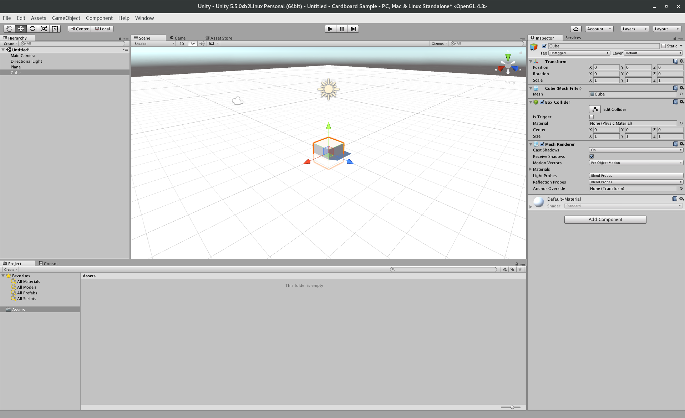
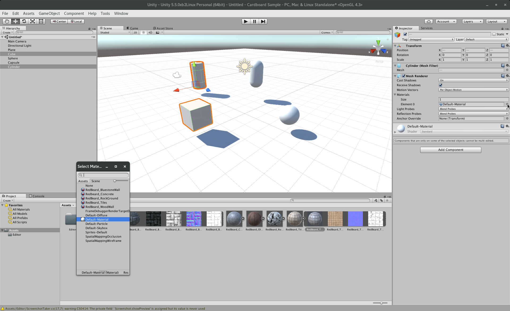
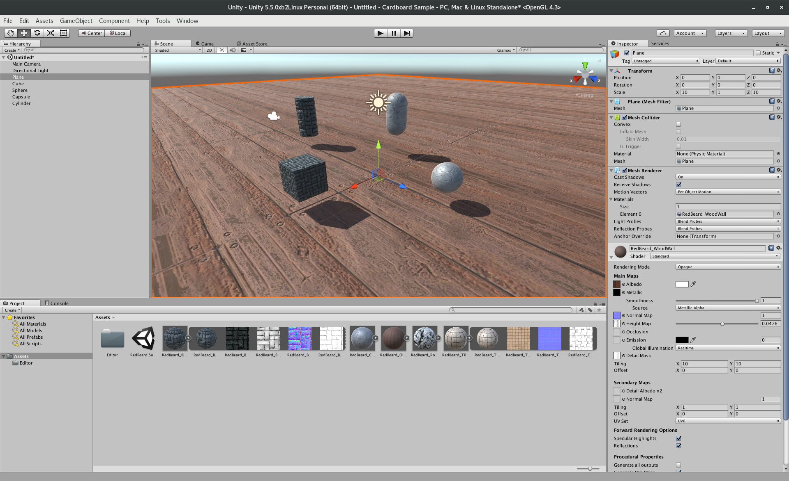
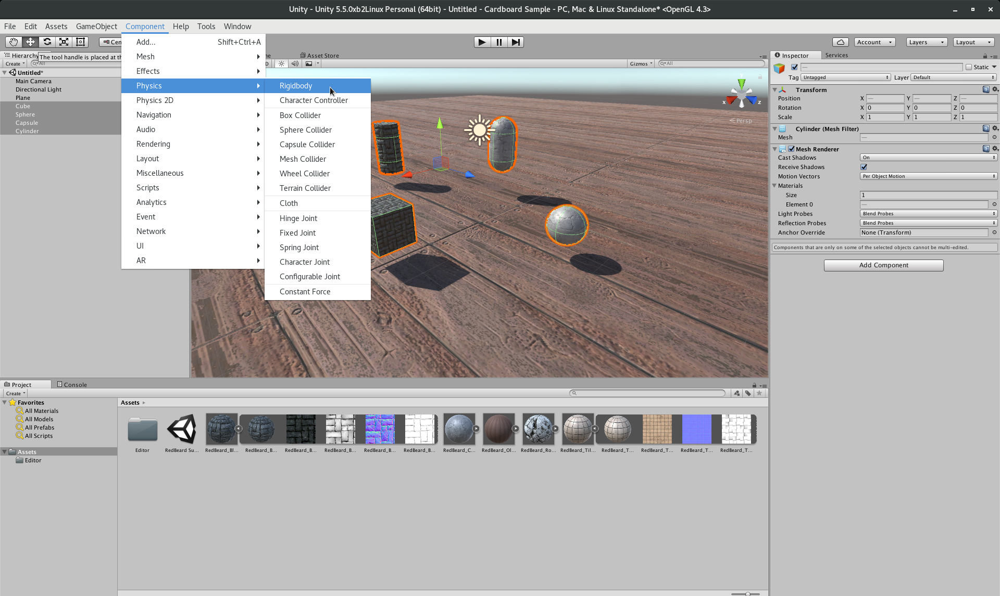

:title: Daydreaming about Cardboards or Virtual Realtiy in Android
:charset: UTF-i8
:author: Mario Bodemann
:css: daydream.css
:skip-help: true
:data-transition-duration: 0

----

:class: hide-background

.. container:: scolling-background

  .. image:: images/scrolling-background-blocky.png
   :width: 30000px

.. container:: main-title

  Daydreaming about Cardboards

.. container:: main-subtitle

  Virtual Reality in Android

.. note::

        Do you want to ask the audience level? (``Android Pro/Medium/Beginner + VR Done'it/Knowsaboutit/new``)

----

:data-x: r2000

.. image:: images/contentful.png
   :width: 500px

* 🔧: headless CMS: `contentful.com <http://contentful.com/>`_
* 🐦: `@MarioBodemann <http://twitter.com/@MarioBodemann>`_
* 📄: `bit.ly/mbvrberlin <http://bit.ly/mbvrberlin>`_

  * Please interrupt!

.. note::

        * Please follow the slides at the given address.
        * Wait some seconds to see if someone is writing down the address...

----

:data-x: -1000
:data-y: 1750
:data-z: 0
:data-scale: 4
:class: hide-background

Agenda

----

:data-x: 0
:data-y: 1300
:data-z: 0
:data-rotate-x: 0
:data-rotate-y: 0
:data-rotate-z: 0
:data-scale: 1

.. image:: images/cardboard.png
   :class: center-image
   :width: 1000px 

----

:data-x: r2000
:data-y: r0

Google Cardboard
----------------

* easy to produce
* available from different companies
* in different styles/interactions
* *You just need a phone™*

.. image:: images/cardboard-viewer.jpg
  :class: bottom-right 

----

How does Cardboard work?
------------------------

* use 3D data and movement to draw two images

  * one for the left and right eye

* contains Lenses to move things away
* brain combines image to 3D scene

----

.. image:: images/contentful-vr-bunny.gif
   :class: center-image

----

How do you program for it?
--------------------------

Googles SDK are available for

* Android (OpenGL)
* IOS (Objective C)
* Unity Engine (C# /JS) x (🍎, G,💻, 🐧)

----

What do those SDKs provide?
---------------------------

* lens distortion correction
* spatial audio
* head tracking
* 3D calibration
* side-by-side rendering

----

What else do they provide?
--------------------------

* stereo geometry configuration
* user input event handling
* see `developer.google.com/vr/android/ <https://developers.google.com/vr/android/>`_

----

:data-x: 0
:data-y: r1300

How do I write a Unity App?

.. image:: images/unity-editor-icon.png
   :class: center-image

----

:data-x: r2000
:data-y: r0

Prerequisites

* clone Googles github for unity https://github.com/googlevr/gvr-unity-sdk repsoitory
* install and open Unity
  
  * 🍎/ 💻: https://store.unity.com/
  * 🐧: http://forum.unity3d.com/threads/unity-on-linux-release-notes-and-known-issues.350256/
        
----

:class: hide-background

.. image:: images/unity-demo-new-project.png
   :class: center-image

.. note::
   Create a new Project

----

:class: hide-background

.. note::
   Name it

----

:class: hide-background

.. image:: images/unity-demo-empty.png
   :class: center-image-huge

.. note::
   See it

----

:data-x: r0
:data-y: r-100
:data-scale: .6
:class: hide-background

.. note::
   Main stage: see everything important happening here

----

:data-x: r2000
:data-y: r100
:data-scale: 1
:class: hide-background

.. image:: images/unity-demo-new-plane-menu.png
   :class: center-image-huge

.. note::
   Populate stage: Add a plane

----

:data-x: r-500
:data-y: r-350
:data-scale: .3
:class: hide-background

.. note::
   Menu > GameObject > 3D Object > Plane

----

:data-x: r2500
:data-y: r350
:data-scale: 1
:class: hide-background

.. image:: images/unity-demo-new-plane-result.png
   :class: center-image-huge

.. note::
   Show GameObject Plane

----

:data-x: r2000
:data-y: r0
:data-scale: 1
:class: hide-background

.. image:: images/unity-demo-inspector.png
   :class: center-image-huge

.. note::
   Change Size of plane

----

:data-x: r650
:data-y: r-200
:data-scale: .4
:class: hide-background

.. note::
   Plane added. Lets make it bigger

----

:data-x: r1350
:data-y: r200
:data-scale: 1
:class: hide-background

.. image:: images/unity-demo-plane-scaled.png
   :class: center-image-huge

.. note::
  Download(?) a material from asset store, to assign to all models: Move Material to right hand object pool.

----

:data-x: r2000
:data-y: r0
:class: hide-background

.. image:: images/unity-demo-new-objects-menu.png
   :class: center-image-huge

.. note::
   Let's add more objects

----

:data-x: r2000
:data-y: r0
:class: hide-background

.. note::
   A Cube appears

----

:class: hide-background

.. image:: images/unity-demo-cube-moved.png
   :class: center-image-huge

.. note::
   Move a cube

----

:data-x: r-50
:data-y: r-150
:data-scale: 0.25
:class: hide-background

.. note::
   Take a look at the cursor.

----

:data-x: r2050
:data-y: r150
:data-scale: 1

Let us add some more objects
============================

* Add a sphere, capsule, cylinder.
* Move them arround

----

:data-x: r2000
:class: hide-background

.. image:: images/unity-demo-more-objects-added.png
   :class: center-image-huge

.. note::
   Cube/Sphere/Cylinder/Capsule

----

:data-x: r350
:data-y: r50
:data-scale: 0.25
:class: hide-background

.. note::
   shows camera preview

----

:data-x: r1650
:data-y: r-50
:data-scale: 1
:class: hide-background

----

:data-x: r-775
:data-y: r200
:data-scale: 0.2
:class: hide-background

.. note::
   Click on favorite assets

----

:data-x: r400
:data-y: r-50
:data-scale: 0.15
:class: hide-background

.. note::
   Click on assetstore

----

:data-x: r0
:data-y: r100
:class: hide-background

.. note::
   Click on an asset which is interesting/looks nice

----

:data-x: r1000
:data-y: r-500
:data-scale: 0.5
:class: hide-background

.. note::
   Check number of assets > objects
   Hit ``import``

----

:data-x: r1375
:data-y: r150
:data-scale: 1
:class: hide-background

.. image:: images/unity-demo-assets-import-dialog.png
   :class: center-image

.. note::
   Import all assets.

----

:data-x: r2000
:data-y: r0
:class: hide-background

----

:data-x: r-150
:data-y: r-200
:data-scale: .3
:class: hide-background

.. note::
   Use SHIFT to click select multiple objects

----

:data-x: r900
:data-y: r0
:class: hide-background

.. note::
   Hit the little hidden button next to the material to assign a material

----

:data-x: r-1250
:data-y: r375
:class: hide-background

.. note::
   Select a material to be assigned and hit ok

----

:data-x: r2500
:data-y: r-175
:data-scale: 1
:class: hide-background

.. note::
   Looks nice, let's simulate

----

:data-x: r2000
:data-y: r0
:class: hide-background

.. image:: images/unity-demo-play-no-rigid.png
   :class: center-image-huge

.. note::
   Hitting play does not reveal any animation.

----

:data-x: r0
:data-y: r-450
:data-scale: 0.2
:class: hide-background

.. note::
   Quickly go back to the previous slide to show nothing has changed.

----

:data-x: r0
:data-y: r450
:data-scale: 1
:class: hide-background

----

:data-x: r2000
:data-y: r0
:class: hide-background

.. note::
   Add rigid body for selected objects

----

:class: hide-background

.. image:: images/unity-demo-rigid-simple.gif
  :class: center-image-huge

.. note::
   show stupidly simple animation

----

:class: hide-background

.. image:: images/unity-demo-rigid-complex.png
   :class: center-image-huge

.. note::
   Copying more objects, lets see the interaction
   Also: I moved the camera inside of the action

----

:class: hide-background

.. image:: images/unity-demo-rigid-complex.gif
   :class: center-image-huge

.. note::
   Now with fancy animations
   Cannot see the other parts, lets use a cardboard!

----

* Import the Unity package by going to Assets > Import Package > Custom Package.

----

* Apply Camera by going to Assets/GoogleVR/Prefabs and move the GvrViewerMain onto the camera.

----

* Play Scene. (Mention building it for Android and provide it later on)

----

What can I do in pure Android only?
-----------------------------------

* ``VrPanoramaView``/``VrVideoView``

  * integration of photospheres in view hierarchies

* integration with other (Java) libraries
* sending of Intents easily

----

Limitations of Android SDK
--------------------------

* using 3D models has to be done by

  * either low level OpenGL or 
  * 3rd party 3d engine

----

Adding Photospheres to a simple project
---------------------------------------

.. note::

        * Open Android Studio.
        * Open ``Simple Android List View`` project.
        * Show current status in ``Vysor``.
        * Add three dependencies by hand: ``Common, CommonWidget, PanoWidget (Sources/Others/gvr-android-sdk/libraries)``
        * Use VrPanoramaView in xml, increasing the ``height`` of view.
        * Use VrPanoramaView in java (adapter)
        * Load image from resources. (``VrPanoramaView.load``, ``BitmapFactory.decoderesource)``

----

:data-x: 0
:data-y: r1300

.. image:: images/daydream-logo.png
   :class: center-image
   :width: 1000px

.. note::

        * Introduced at Google I/O this year.
        * Soon™ first hardware available.

----

:data-x: r2000
:data-y: r0

:class: hide-background

.. image:: images/daydream-headset.png
   :height: 800px

----

:class: hide-background
:data-x: r190
:data-y: r240
:data-z: r-800

.. note::

        Controller

        * uses special hardware as controller

                * can get emulated by any Android phone (>= 4.4)
                * has four Buttons: Volume +/-, App(Programmable), Home
                * clickable Touchpad. (x/y position, clicked state)(emulated by two touches)

        * Print out sheet to not get to disctracted by Phone
        * Connects via bluetooth to ``Headset Phone``

----

:class: hide-background
:data-x: r-400
:data-y: r-12
:data-z: r100

.. note::

        Headset Phone

        * has to be a ``Nexus 6P`` running ``Android Nougat 7.0``
        * start a Daydream app once, set it up by clicking on the ``Gear``, enabling all VR settings
        * ``Reboot phone ...`` ;) .
        * Bluetooth to connect to controller.

----

:class: hide-background
:data-x: r210
:data-y: r-228
:data-z: r700

.. note::

        Complete Package

        * ``Daydream Ready``

                * high performance sensors for high accuracy head tracking
                * displays with fast response time to minimize blur
                * powerfull mobile processor
                * VR System notifications

        * will be available ``in fall``
        * will be created by hardware partners
        * certified by ``Google``
        * Google Play for VR and ``Daydream Home``

----

:data-x: r2000
:data-y: r0
:data-z: r0

New SDK features
----------------

* Controlling the controller

  * orientation/acceleration 
  * clickpad (x,y, clicked)
  * buttons (App, Vol+/-)

* spatial audio engine

----

Deprecation & Deletion
----------------------

* ``deprecation of v1.0 Cardboards`` 😱

  * magnets are uncool!
  * deprecation of cardboard button infavor of controller

* renaming ``Cardboard*`` packages to ``Gvr*``

----

:data-x: -3000
:data-y: 1800
:data-z: 3000
:data-rotate-x: 0
:data-rotate-y: -75
:data-rotate-z: 90
:class: last-slide

What will you build?

* `🎥 General <https://youtu.be/rOCaujUOCuE>`_ `🎥 Controller <https://www.youtube.com/watch?v=l9OfmWnqR0M>`_ `🎥 Designing <https://www.youtube.com/watch?v=00vzW2-PvvE>`_
* `📄 Google VR <https://vr.google.com>`_ `Github <https://github.com/googlevr/gvr-android-sdk>`_
* `🐦@MarioBodemann <http://twitter.com/@MarioBodemann>`_

