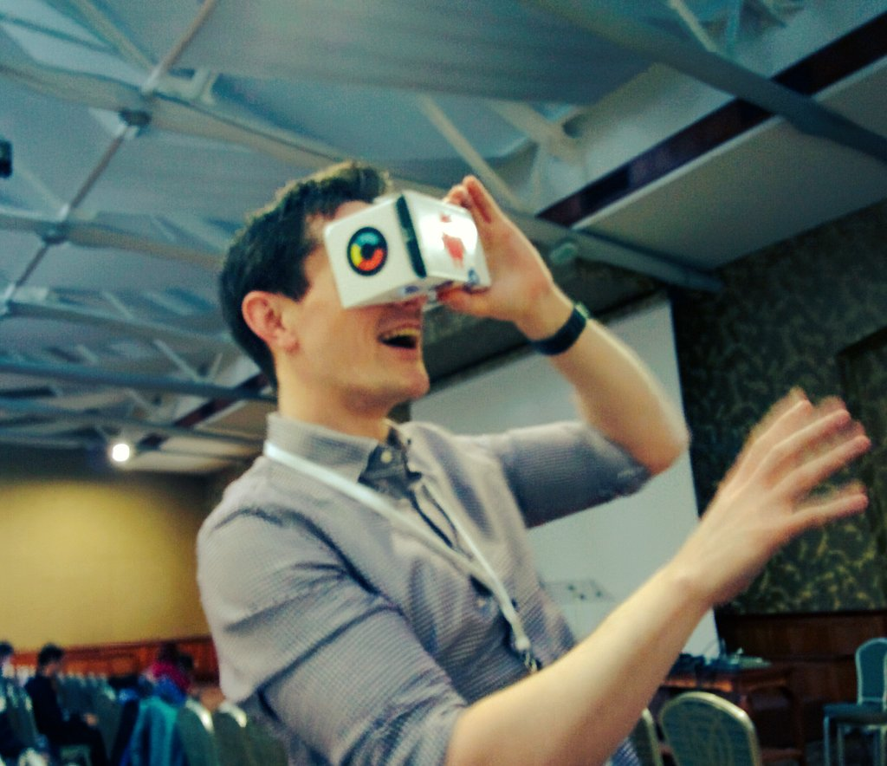

:title: Daydreaming about Cardboards or Virtual Realtiy in Android
:charset: UTF-i8
:author: Mario Bodemann
:css: daydream.css
:skip-help: true
:data-transition-duration: 0

----

:data-x: 0
:data-y: 0
:data-z: 0
:data-rotate-y: 0

.. image:: images/cardboard.png
   :width: 200px

.. container:: scolling-background

  .. image:: images/scrolling-background.jpg
   :width: 21000px

.. container:: main-title

  Daydreaming about Cardboards

.. container:: main-subtitle

  Virtual Reality in Android

.. note::

        Do you want to ask the audience level? (``Android Pro/Medium/Beginner + VR Done'it/Knowsaboutit/new``)

----

:data-x: r1700

.. image:: images/contentful.png
   :width: 500px

* 🔧: headless CMS: `contentful.com <http://contentful.com/>`_
* 🐦: `@MarioBodemann <http://twitter.com/@MarioBodemann>`_
* 📄: `bit.ly/mbvrberlin <http://bit.ly/mbvrberlin>`_

  * Please interrupt!

.. note::

        * Please follow the slides at the given address.
        * Wait some seconds to see if someone is writing down the address...

----

:data-x: 0
:data-y: r1000

Agenda
------

* .. image:: images/cardboard.png
   :width: 300px
  
* .. image:: images/daydream-logo.png
   :width: 300px
 
.. note:: 

  * Cardboard
    
    * Overview
    * Demos (unity/java)

  * Daydream

    * Overview
    * Differences to Cardboard

----

.. image:: images/cardboard.png
   :class: center-image
   :width: 1000px 

----

:data-x: r1700
:data-y: r0

Google Cardboard
----------------

* easy to produce
* available from different companies
* in different styles/interactions
* *You just need a phone™*

.. image:: images/cardboard-viewer.jpg
  :class: bottom-right 

----

`🐦 @themightyjon using Cardboard <https://twitter.com/MarioBodemann/status/708665949663195140>`_

----

How does Cardboard work?
------------------------

* use 3D data and movement to draw two images

  * one for the left and right eye

* contains Lenses to move things away
* brain combines image to 3D scene

----

.. image:: images/contentful-vr-bunny.gif
   :class: center-image

----

How do you program for it?
--------------------------

Googles SDK are available for

* Android (OpenGL)
* IOS (Objective C)
* Unity Engine (C# /JS) x (🍎, G,💻, 🐧)

----

How do I write a Unity App?
---------------------------

Demo time!
==========

.. image:: images/unity-editor-icon.png

.. note::
        
        * Clone googles github: https://github.com/googlevr/gvr-unity-sdk
        * Open Unity.
        * Add GameObject Plane(Rescale 10x10x10), Cube, Sphere, Cylinder, move/rotate(top gizmo) them around.
        * Download(?) a material from asset store, to assign to all models: Move Material to right hand object pool.
        * Assign rigid body (aka gravity) (Component/Physics/Rigid).
        * Duplicate some object to increase dynamic of scene. Play Scene.
        * Import the Unity package by going to Assets > Import Package > Custom Package.
        * Apply Camera by going to Assets/GoogleVR/Prefabs and move the GvrViewerMain onto the camera.
        * Play Scene. (Mention building it for Android and provide it later on)

        **Installing Unity on linux**

        * http://forum.unity3d.com/threads/unity-on-linux-release-notes-and-known-issues.350256/

----

What do those SDKs provide?
---------------------------

* lens distortion correction
* spatial audio
* head tracking
* 3D calibration
* side-by-side rendering

----

What else do they provide?
--------------------------

* stereo geometry configuration
* user input event handling
* see `developer.google.com/vr/android/ <https://developers.google.com/vr/android/>`_

----

What can I do in pure Android only?
-----------------------------------

* ``VrPanoramaView``/``VrVideoView``

  * integration of photospheres in view hierarchies

* integration with other (Java) libraries
* sending of Intents easily

----

Limitations of Android SDK
--------------------------

* using 3D models has to be done by

  * either low level OpenGL or 
  * 3rd party 3d engine

----

Adding Photospheres to a simple project
---------------------------------------

* demo

.. image:: images/nougat_2x.png
   :class: bottom-right

.. note::

        * Open Android Studio.
        * Open ``Simple Android List View`` project.
        * Show current status in ``Vysor``.
        * Add three dependencies by hand: ``Common, CommonWidget, PanoWidget (Sources/Others/gvr-android-sdk/libraries)``
        * Use VrPanoramaView in xml, increasing the ``height`` of view.
        * Use VrPanoramaView in java (adapter)
        * Load image from resources. (``VrPanoramaView.load``, ``BitmapFactory.decoderesource)``

----

:data-x: 0
:data-y: r1000

.. image:: images/daydream-logo.png
   :class: center-image
   :width: 1000px

.. note::

        * Introduced at Google I/O this year.
        * Soon™ first hardware available.

----

:data-x: r1700
:data-y: r0

:class: hide-background

.. image:: images/daydream-headset.png
   :height: 800px

----

:class: hide-background
:data-x: r190
:data-y: r240
:data-z: r-800

.. note::

        Controller

        * uses special hardware as controller

                * can get emulated by any Android phone (>= 4.4)
                * has four Buttons: Volume +/-, App(Programmable), Home
                * clickable Touchpad. (x/y position, clicked state)(emulated by two touches)

        * Print out sheet to not get to disctracted by Phone
        * Connects via bluetooth to ``Headset Phone``

----

:class: hide-background
:data-x: r-400
:data-y: r-12
:data-z: r100

.. note::

        Headset Phone

        * has to be a ``Nexus 6P`` running ``Android Nougat 7.0``
        * start a Daydream app once, set it up by clicking on the ``Gear``, enabling all VR settings
        * ``Reboot phone ...`` ;) .
        * Bluetooth to connect to controller.

----

:class: hide-background
:data-x: r210
:data-y: r-228
:data-z: r700

.. note::

        Complete Package

        * ``Daydream Ready``

                * high performance sensors for high accuracy head tracking
                * displays with fast response time to minimize blur
                * powerfull mobile processor
                * VR System notifications

        * will be available ``in fall``
        * will be created by hardware partners
        * certified by ``Google``
        * Google Play for VR and ``Daydream Home``

----

:data-x: r1700
:data-y: r0
:data-z: r0

New SDK features
----------------

* Controlling the controller

  * orientation/acceleration 
  * clickpad (x,y, clicked)
  * buttons (App, Vol+/-)

* spatial audio engine

----

Deprecation & Deletion
----------------------

* ``deprecation of v1.0 Cardboards`` 😱

  * magnets are uncool!
  * deprecation of cardboard button infavor of controller

* renaming ``Cardboard*`` packages to ``Gvr*``

----

:data-x: -1600
:data-y: 1800
:data-z: 2500
:data-rotate-x: 0
:data-rotate-y: -60
:data-rotate-z: 90
:class: last-slide

What would you build?

* `🎥 General <https://youtu.be/rOCaujUOCuE>`_ `🎥 Controller <https://www.youtube.com/watch?v=l9OfmWnqR0M>`_ `🎥 Designing <https://www.youtube.com/watch?v=00vzW2-PvvE>`_
* `📄 Google VR <https://vr.google.com>`_ `Github <https://github.com/googlevr/gvr-android-sdk>`_
* `🐦@MarioBodemann <http://twitter.com/@MarioBodemann>`_

