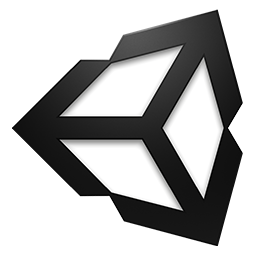
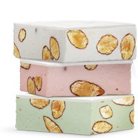

:title: Daydreaming about Cardboards or Virtual Realtiy in Android
:charset: UTF-i8
:author: Mario Bodemann
:css: daydream.css
:skip-help: true
:data-transition-duration: 0

----

:data-x: 0
:data-y: 0
:data-z: 0
:data-rotate-y: 0

.. image:: images/cardboard.png
   :width: 200px

.. container:: scolling-background

  .. image:: images/scrolling-background.jpg
   :width: 20000px

.. container:: main-title

  Daydreaming about Cardboards

.. container:: main-subtitle

  Virtual Reality in Android

----

:data-x: r1700

* 🔧: headless CMS: `contentful.com <http://contentful.com/>`_

.. image:: images/contentful.png
   :width: 500

* 🐦: `@MarioBodemann <http://twitter.com/@MarioBodemann>`_
* 📄: `bit.ly/mbcbrd <http://bit.ly/mbcbrd>`_

----

.. image:: images/cardboard.png
   :class: center-image
   :width: 1000px 

----

Google Cardboard
----------------

* Easy to produce
* Available from different companies
* In different styles/interactions
* *You just need a phone.*

.. image:: images/cardboard-viewer.jpg
  :class: bottom-right 

----

How does Cardboard work?
------------------------

* Use 3D data and movement to draw two images

  * one for the left and right eye each.

* Distort images for the lenses.
* Brain combines image to 3D scene.

----

How do you program for it?
--------------------------

SDKs available for 

* Android (OpenGL)
* IOS (Objective C)
* Web (JS)
* Unity Engine (C# /JS)

----

How do I write a Unity App?
---------------------------

Aka demo time!
==============

.. note::
        
        * Clone googles github: https://github.com/googlevr/gvr-unity-sdk
        * Open Unity.
        * Add GameObject Plane(Rescale 10x10x10), Cube, Sphere, Cylinder, move/rotate(top gizmo) them around.
        * Download(?) a material from asset store, to assign to all models: Move Material to right hand object pool.
        * Assign rigid body (aka gravity) (Component/Physics/Rigid).
        * Duplicate some object to increase dynamic of scene. Play Scene.
        * Import the Unity package by going to Assets > Import Package > Custom Package.
        * Apply Camera by going to Assets/GoogleVR/Prefabs and move the GvrViewerMain onto the camera.
        * Play Scene. (Mention building it for Android and provide it later on)

        **Installing Unity on linux**

        * http://forum.unity3d.com/threads/unity-on-linux-release-notes-and-known-issues.350256/
        * chmod a+x \*installer\*.sh; sudo \*installer\*.sh

----

What do those SDKs provide?
---------------------------

* 3D setup (left/right eye translation and rendering)
* Lensdistortion correction
* Adoption of cardboard movement to scene
* Panorama of 360 degree Photospheres (more later)

----

What can I do in pure Android only?
-----------------------------------

* VrPanoramaView/VrVideoView

  * Integration of photospheres in view hierarchies.

* Integration with other (Java) libraries.
* Sending Intents easily.

----

Limitations of Android SDK
--------------------------

* Rendering of 3D scene has to be done by

  * either low level OpenGL or 
  * 3rd party 3d engine

* Setup of ``Google VR`` libraries

  * Own Android Studio Project for all ``.aar`` files needed

----

Adding a Photosphere to an simple project
-----------------------------------------

* Demo
* How to add a Photosphere view to your hierarchy

.. note::

        * Open Android Studio.
        * Open ``Simple Android List View`` project.
        * Show current status in Resource preview.
        * Point out all dependencies are already added. (think about adding them)
        * Use VrPanoramaView in xml
        * Use VrPanoramaView in java (adapter)
        * set image from resources.

----

:data-x: 0
:data-y: 1000

.. image:: images/daydream.png
   :class: center-image

----

:data-x: r1700

How does it differ from Cardboard?
----------------------------------

* Same basis, SDK, etc.
* New

  * Controller!
  * Certification!
  * Noughat!

-----

:data-x: -1700
:data-y: 1900
:data-z: 2000
:data-rotate-x: 0
:data-rotate-y: -60
:data-rotate-z: 90
:class: last-slide

Thank you
=========

