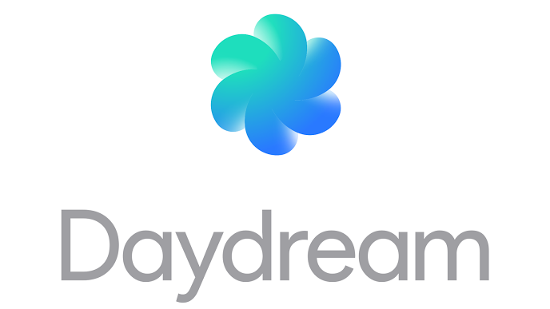

:title: Daydreaming about Cardboards or Virtual Realtiy in Android
:charset: UTF-i8
:author: Mario Bodemann
:css: daydream.css
:skip-help: true
:data-transition-duration: 0

----

:data-x: 0
:data-y: 0
:data-z: 0
:data-rotate-y: 0

.. image:: images/cardboard.png
   :width: 200px

.. container:: scolling-background

  .. image:: images/scrolling-background.jpg
   :width: 20000px

.. container:: main-title

  Daydreaming about Cardboards

.. container:: main-subtitle

  Virtual Reality in Android

----

:data-x: r1700

* 🔧: headless CMS: `contentful.com <http://contentful.com/>`_

.. image:: images/contentful.png
   :width: 500

* 🐦: `@MarioBodemann <http://twitter.com/@MarioBodemann>`_
* 📄: `bit.ly/mbcbrd <http://bit.ly/mbcbrd>`_

----

.. image:: images/cardboard.png
   :class: center-image
   :width: 1000px 

----

Google Cardboard
----------------

* Easy to produce
* Available from different companies
* In different styles/interactions
* *You just need a phone.*

.. image:: images/cardboard-viewer.jpg
  :class: bottom-right 
  :width: 30%

----

How does Cardboard work?
------------------------

* Use 3D data and movement to draw two images

  * one for the left and right eye each.

* Distort images for the lenses.
* Brain combines image to 3D scene.

----

How do you program for it?
--------------------------

SDKs available for 

* Android (*OpenGL*)
* IOS (*Objective C*)
* Web (*JS*)
* Unity Engine (C# /JS)

----

What can I only do in Android?
------------------------------

----

----

How does it differ from Cardboard?
----------------------------------

* Same basis, SDK, etc.
* New

  * Controller!
  * Certification!
  * Noughat

-----

:data-x: -2000
:data-y: 3000
:data-z: 2000
:data-rotate-x: 0
:data-rotate-y: -60
:data-rotate-z: 90
:class: last-slide

Thank you
=========

